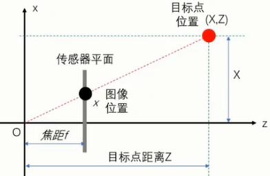
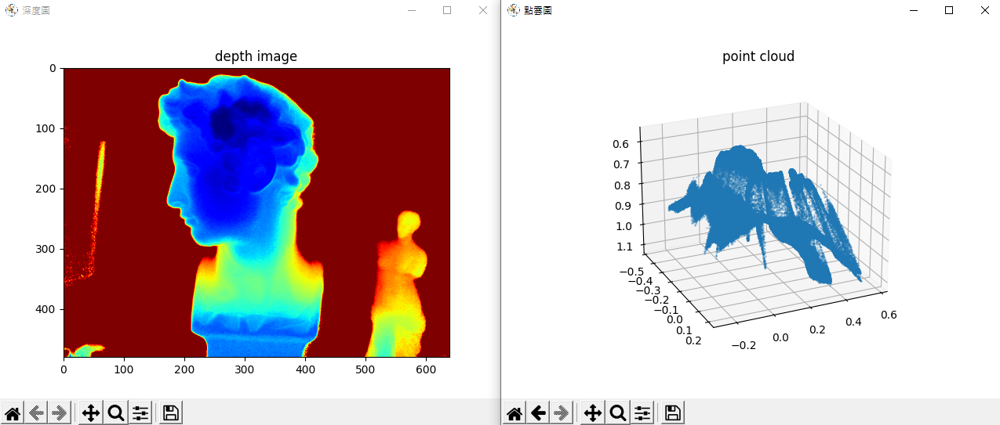

本筆記為應忍冬老師的課程《3D感知技術與實踐》的學習筆記[^1]。

## 1. 3D光學測量方法概述

- 被動測量：利用自然光在物體表面反射形成的**2D圖片進行3D信息的重建**
    - 單目立體視覺（聚焦法、離焦法）
    - 雙目立體視覺（利用兩個2D圖像各個像素的位置偏差重建3D信息）
    - 多目立體視覺（原理同雙目立體視覺）
- 主動測量：主動發射能量信號，利用物體表面**反射特性**及**信號的傳播特性**實現對物體的3D信息的測量
    - 結構光法（特定紋理光綫投到物體表面，然後根據物體形狀對光的影響計算出3D信息）
        - 光點法
        - 光條法
        - 光面法
    - 飛行時間法（用調制信號算反射光的相位差）
        - 脈衝激光
        - 連續激光

## 2. 針孔相機模型

一般把相機看作透鏡模型，如果把鏡頭中心看作針孔，可將透鏡模型看作針孔相機模型（因爲它們數學模型一致）。

### 2.1 物體表面某點的真實位置（3D坐標）與在圖像傳感器上的像（2D坐標）的關係

所有點的3D坐標（位置XYZ）和2D坐標（投影xy）的連綫一定過針孔（光心）位置。

如果我們規定3D坐標軸的**Z軸**與**圖像傳感器**垂直，3D坐標軸的X軸Y軸與2D坐標軸的X軸Y軸的坐標同向，那麽3D點就跟2D點形成了相似三角形的關係，即$\frac{X}{x} = \frac{Z}{f}$。



由透鏡模型可知，圖像傳感器與光心的距離即焦距$f$是已知的，由圖像傳感器能得到$x$，所以如果再有Z坐標，就能求出X坐標。

$$ X = x \cdot \frac{Z}{f} $$

把上面那個圖的視角繞Z軸90°可知，Y坐標的計算跟X坐標是一樣的，所以在知道Z坐標的情況下，用相似三角形關係也可以求出Y坐標。

$$ Y = y \cdot \frac{Z}{f} $$

### 2.2 像素坐標與物理坐標的轉換

由圖像傳感器直接得到的坐標是**像素坐標**$u$$v$，要先把它們轉化爲**物理坐標**$x$$y$才能用。

1. Z軸過圖像傳感器的點（即物理坐標原點 $x=0$, $y=0$）與像素坐標原點不是重合的，這個偏移量記作 $c_x$, $c_y$，是以像素為單位的。用像素坐標$u$$v$減去像素偏移量$c_x$$c_y$就能得到以傳感器中心為原點的坐標；
2. 像素坐標單位是像素（暫記為$p$），物理坐標單位為米$m$，用物理坐標與像素坐標之比$s_x$$s_y$將$u$$v$轉爲$x$$y$（$s_x$和$s_y$一般是相等的吧？我瞎猜的）；
    $$ x = s_x(u-c_x) $$
    $$ y = s_y(v-c_y) $$
3. 代入2.1節那倆公式可以得到像素坐標與3D坐標的關係；
    $$ X = \frac{Z}{f/s_x} \cdot (u-c_x) $$
    $$ Y = \frac{Z}{f/s_y} \cdot (v-c_y) $$
4. 一般把比例係數$s_x$$s_y$與焦距$f$合并，令$ f_x = \frac{f}{s_x} $，$ f_y = \frac{f}{s_y} $。
    $$ X = \frac{Z}{f_x} \cdot (u-c_x) $$
    $$ Y = \frac{Z}{f_y} \cdot (v-c_y) $$

一般把{$f_x,\,f_y,\,c_x,\,c_y$}稱爲**相機内參**，由相機内參組成的轉換矩陣稱爲内參矩陣。以下是矩陣形式的像素坐標與位置坐標的轉換關係。
$$
Z \cdot
\left[\begin{array}{c}
    u \\
    v \\
    1 
\end{array}\right]
=
\left[\begin{array}{ccc}
    f_x & 0 & c_x \\
    0 & f_y & c_y \\
    0 & 0 & 1
\end{array}\right]
\times
\left[\begin{array}{c}
    X \\
    Y \\
    Z 
\end{array}\right]
$$

### 2.3 實踐

輸出：



代碼：
```cpp
# -*- coding: utf-8 -*-

'''
===============================================================================
||   Authors   | 劉啟迪(Qidi Liu)
||-------------|---------------------------------------------------------------
||   License   | Private
||-------------|---------------------------------------------------------------
|| Description | 把深度圖轉爲點雲（把圖像傳感器獲取的2D坐標轉爲3D位置）
===============================================================================
'''

__author__ = 'QidiLiu'

import os
import numpy as np
import matplotlib.pyplot as plt

import sys
sys.path.append('utils')
from utils.workspaces_settings import *
from utils.partial_code_depth_to_pc import *


def main():
    img = np.genfromtxt('img/img_dep_640x480.csv',
                        delimiter=',').astype(np.float32)
    plt.figure('深度圖')
    plt.imshow(np.clip(img, 0.55, 0.7), cmap='jet')    # 显示加载的深度图
    plt.title('depth image')

    _u, _v = np.mgrid[0:CAM_HGT, 0:CAM_WID]
    _cx = np.ones([CAM_HGT, CAM_WID], np.float32) * CAM_CX
    _cy = np.ones([CAM_HGT, CAM_WID], np.float32) * CAM_CY
    _u_minus_cx = _u - _cx
    _v_minus_cy = _v - _cy
    _X = img / CAM_FX * _u_minus_cx
    _Y = img / CAM_FY * _v_minus_cy
    print(_X.shape, _Y.shape, img.shape)

    _XYZ = np.concatenate([_Y[:, :, np.newaxis], _X[:, :, np.newaxis], img[:, :, np.newaxis]], 2)
    print(_XYZ.shape)
    pc = np.reshape(_XYZ, [-1, 3])
    print(pc.shape)

    np.savetxt('img/pc.csv', pc, fmt='%.18e', delimiter=',', newline='\n')
    
    pc = np.genfromtxt('img/pc.csv', delimiter=',').astype(np.float32)
    plt.figure('點雲圖')
    ax = plt.figure('點雲圖').gca(projection='3d')
    ax.plot(pc[:, 0], pc[:, 1], pc[:, 2], '.', markersize=0.5)
    plt.title('point cloud')

    plt.show()


if __name__ == '__main__':
    os.chdir(WORKING_DIR)
    main()
```

## 3. 雙目3D視覺原理

## 4. 結構光3D成像原理

## 5. TOF 3D成像原理

## 6. 圖像畸變與校正

## 7. RGB-D融合概述

[^1]: https://college.aiimooc.com/preview/725 3D感知技术与实践
