本筆記為應忍冬老師的課程《3D感知技術與實踐》的學習筆記[^1]。

## 1. 3D光學測量方法概述

- 被動測量：利用自然光在物體表面反射形成的**2D圖片進行3D信息的重建**
    - 單目立體視覺（聚焦法、離焦法）
    - 雙目立體視覺（利用兩個2D圖像各個像素的位置偏差重建3D信息）
    - 多目立體視覺（原理同雙目立體視覺）
- 主動測量：主動發射能量信號，利用物體表面**反射特性**及**信號的傳播特性**實現對物體的3D信息的測量
    - 結構光法（特定紋理光綫投到物體表面，然後根據物體形狀對光的影響計算出3D信息）
        - 光點法
        - 光條法
        - 光面法
    - 飛行時間法（用調制信號算反射光的相位差）
        - 脈衝激光
        - 連續激光

## 2. 針孔相機模型

一般把相機看作透鏡模型，如果把鏡頭中心看作針孔，可將透鏡模型看作針孔相機模型（因爲它們數學模型一致）。

### 2.1 物體表面某點的真實位置（3D坐標）與在圖像傳感器上的像（2D坐標）的關係

所有點的3D坐標（位置XYZ）和2D坐標（投影xy）的連綫一定過針孔（光心）位置。

如果我們規定3D坐標軸的**Z軸**與**圖像傳感器**垂直，3D坐標軸的X軸Y軸與2D坐標軸的X軸Y軸的坐標同向，那麽3D點就跟2D點形成了相似三角形的關係，即$\frac{X}{x} = \frac{Z}{f}$。


由透鏡模型可知，圖像傳感器與光心的距離即焦距$f$是已知的，由圖像傳感器能得到$x$，所以如果再有Z坐標，就能求出X坐標。

$$ X = x \cdot \frac{Z}{f} $$

把上面那個圖的視角繞Z軸90°可知，Y坐標的計算跟X坐標是一樣的，所以在知道Z坐標的情況下，用相似三角形關係也可以求出Y坐標。

$$ Y = y \cdot \frac{Z}{f} $$

### 2.2 像素坐標與物理坐標的轉換

由圖像傳感器直接得到的坐標是**像素坐標**$u$$v$，要先把它們轉化爲**物理坐標**$x$$y$才能用。

1. Z軸過圖像傳感器的點（即物理坐標原點 $x=0$, $y=0$）與像素坐標原點不是重合的，這個偏移量記作 $c_x$, $c_y$，是以像素為單位的。用像素坐標$u$$v$減去像素偏移量$c_x$$c_y$就能得到以傳感器中心為原點的坐標；
2. 像素坐標單位是像素（暫記為$p$），物理坐標單位為米$m$，用物理坐標與像素坐標之比$s_x$$s_y$將$u$$v$轉爲$x$$y$（$s_x$和$s_y$一般是相等的吧？我瞎猜的）；
    $$ x = s_x(u-c_x) $$
    $$ y = s_y(v-c_y) $$
3. 代入2.1節那倆公式可以得到像素坐標與3D坐標的關係；
    $$ X = \frac{Z}{f/s_x} \cdot (u-c_x) $$
    $$ Y = \frac{Z}{f/s_y} \cdot (v-c_y) $$
4. 一般把比例係數$s_x$$s_y$與焦距$f$合并，令$f_x = \frac{f}{s_x}$，$f_y = \frac{f}{s_y}$，就得到簡化版的轉換公式。
    $$ X = \frac{Z}{f_x} \cdot (u-c_x) $$
    $$ Y = \frac{Z}{f_y} \cdot (v-c_y) $$

一般把{$f_x,\,f_y,\,c_x,\,c_y$}稱爲**相機内參**，由相機内參組成的轉換矩陣稱爲内參矩陣。以下是矩陣形式的像素坐標與位置坐標的轉換關係。
$$
Z \cdot
\left[\begin{array}{c}
    u \\
    v \\
    1 
\end{array}\right]
=
\left[\begin{array}{ccc}
    f_x & 0 & c_x \\
    0 & f_y & c_y \\
    0 & 0 & 1
\end{array}\right]
\times
\left[\begin{array}{c}
    X \\
    Y \\
    Z 
\end{array}\right]
$$

### 2.3 實踐

輸出：


代碼：
```python
# -*- coding: utf-8 -*-

'''
===============================================================================
||   Authors   | 劉啟迪(Qidi Liu)
||-------------|---------------------------------------------------------------
||   License   | Private
||-------------|---------------------------------------------------------------
|| Description | 把深度圖轉爲點雲（把圖像傳感器獲取的2D坐標轉爲3D位置）
===============================================================================
'''

__author__ = 'QidiLiu'

import os
import numpy as np
import matplotlib.pyplot as plt

import sys
sys.path.append('utils')
from utils.workspaces_settings import *
from utils.partial_code_depth_to_pc import *


def main():
    img = np.genfromtxt('img/img_dep_640x480.csv',
                        delimiter=',').astype(np.float32)
    plt.figure('深度圖')
    plt.imshow(np.clip(img, 0.55, 0.7), cmap='jet')    # 显示加载的深度图
    plt.title('depth image')

    _u, _v = np.mgrid[0:CAM_HGT, 0:CAM_WID]
    _cx = np.ones([CAM_HGT, CAM_WID], np.float32) * CAM_CX
    _cy = np.ones([CAM_HGT, CAM_WID], np.float32) * CAM_CY
    _u_minus_cx = _u - _cx
    _v_minus_cy = _v - _cy
    _X = img / CAM_FX * _u_minus_cx
    _Y = img / CAM_FY * _v_minus_cy
    print(_X.shape, _Y.shape, img.shape)

    _XYZ = np.concatenate([_Y[:, :, np.newaxis], _X[:, :, np.newaxis], img[:, :, np.newaxis]], 2)
    print(_XYZ.shape)
    pc = np.reshape(_XYZ, [-1, 3])
    print(pc.shape)

    np.savetxt('img/pc.csv', pc, fmt='%.18e', delimiter=',', newline='\n')
    
    pc = np.genfromtxt('img/pc.csv', delimiter=',').astype(np.float32)
    plt.figure('點雲圖')
    ax = plt.figure('點雲圖').gca(projection='3d')
    ax.plot(pc[:, 0], pc[:, 1], pc[:, 2], '.', markersize=0.5)
    plt.title('point cloud')

    plt.show()


if __name__ == '__main__':
    os.chdir(WORKING_DIR)
    main()
```

## 3. 雙目3D視覺

用兩個**同一高度**的相機**平行**地進行拍攝，用同一目標在兩相機的視差可求出距離$Z$（也是用相似三角形關係計算）。

### 3.1 推理過程

#### 相似三角形關係

如圖所示，點的位置、像的坐標和焦點的位置形成了相似三角形，小三角形的高與底邊之比跟大三角形的高與底邊之比相等，所以能求出$Z$。

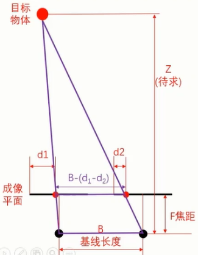

兩個三角形的高與底邊之比為：

$$ \frac{Z - f}{B - (d_1 - d_2)} = \frac{Z}{B} $$

設$\Delta d = d_1 - d_2$，則上式經化簡后可得距離$Z$為：

$$ Z = \frac{Bf}{\Delta d} $$

看起來蠻簡單的，但小三角形的底邊爲啥等於$B-(d_1-d_2)$呢？反正我沒有一眼就看出來，下面是小三角形的底邊求解過程：

設小三角形底邊為$w$，左邊像的坐標減去左成像面中點坐標為$h_1$（注意奧，這個差是有正負的，因爲像有可能在終點左邊也可能在中點右邊），同樣的，右邊像的坐標減去右成像面中點坐標為$h_2$。下圖用來幫助理解這種設定，不包含所有情況。由於右邊像在右成像面中點的左邊，所以在這種情況下右像與右中點的距離為$-h_2$。

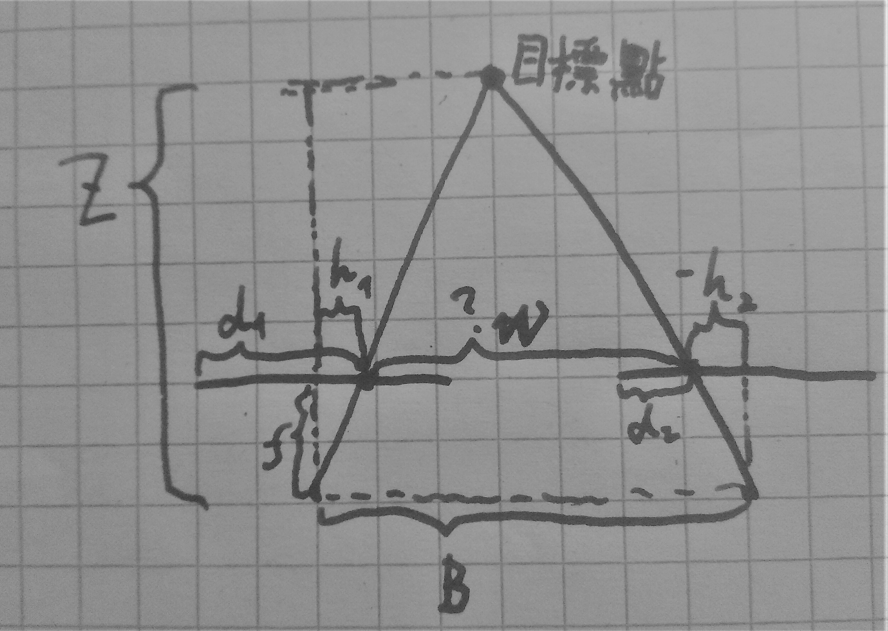

由於成像面中點位置固定且左右成像面一樣大，左成像面的左半邊長度為$d_1-h_1$，右成像面的左半邊長度爲$d_2-h_2$，所以$d_1-h_1 = d_2-h_2$，於是有：

$$ d_1 - d_2 = h_1 - h_2 $$

大三角形的底邊長為$B$，即左中點到右中點的距離為$B$。不管目標點在哪，總有：

$$ B = w + h_1 - h_2 $$

所以

$$ w = B - (h_1 - h_2) = B - (d_1 - d_2) $$

#### 橫向匹配

最有意思的地方是雙目相機的橫向匹配。求每個目標點的視差，最直接的辦法是用滑窗把左像分成很多個子圖像，挨個從右像找最優匹配，找到後把兩者的橫坐標一減，往上面用相似三角形推出來的公式裏一套就得到了這一點的$Z$坐標。雖然粗暴，但是能用。這裏所謂的匹配是指模板匹配，具體算法可參考[我之前寫的這篇筆記](https://zhuanlan.zhihu.com/p/509925981)[^2]。除了模板匹配還有很多別的算法，可以參考[這篇文章](https://zhuanlan.zhihu.com/p/31243203)[^3]。

優雅一點，我們找匹配的時候不用全圖都找，與左像子圖像匹配的圖一定在同一高度上，而且一定在有點靠左的位置，所以只需要從右像中原坐標左邊的幾個滑窗找最優匹配即可（也叫視差搜索範圍 the disparity search range）。

更優雅一點，我們可以盡量減少滑窗的重複使用，具体步骤如下：
1. 先把右像整體左移，得到几張經過不同程度左移的圖像組成的3維矩陣；
2. 用所有左移后的右像分別與左像相減，再求絕對值，得到了左像每個像素跟左移后的右像的絕對差值；
3. 這時再用滑窗求滑窗内絕對差值的和（這個算法英文叫SAD，全稱Sum of absolute differences，其基本運算思想是求取相對應的兩個像素塊内像素值之差的絕對值之和[^4]），每個像素對應一個滑窗；
4. 然後從每個像素的第三維度找最小絕對插值，就知道了這個像素對應的視差；
5. 最後往公式裏一套就得到了每個像素的$Z$坐標。

### 3.2 OpenCV抽象類StereoBM

OpenCV提供了以下四種雙目視覺算法的函數[^3]，目前只看了基於像素塊絕對差值之和（SAD算法）的第一種，即StereoBM。其他的有空再看（這裏説的是2.x版本的OpenCV，在3.0後的版本裏第3、4個已經被OpenCV砍了，新加了個StereoBliefPropagation算法，但是需要用CUDA運行[^10]）。
- Block Matching（BM）: StereoBM
- Semi-Global Block Matching（SGBM）: StereoSGBM
- Graph Cut（GC）: cvStereoGCState()
- Dynamic Programming（DP）: cvFindStereoCorrespondence()

四種算法對比[^3][^9]：
- 精度：GC > SGBM > DP > BM
- 速度：GC < SGBM < DP < BM

OpenCV還提供了StereoBinaryBM和StereoBinarySGBM[^5]，與StereoBM和StereoSGBM用法類似但實現方法不同（但是具體有多不同我也沒仔細看，只知道加的Binary是因爲用了Census transform和Hamming distance，我就粗略看了下，維基上説對亮度分佈表現很好）。

除了上面提到的像素塊絕對差值之和算法，OpenCV的StereoBM還做了圖像預處理（用Sobel算子求紋理值，并設置了截斷值）、紋理值閾值等各種閾值檢查、後處理（中值濾波、連通域檢測等）以及對結果的二次插值（得到較連續的視差值）[^6][^7][^8][^9]。

以下是cv::StereoBM的使用方法，所有為數字的參數都是int型。東西太多，懶得記python版了，用到的時候查文檔吧。

cv::StereoBM是個抽象類，不能實例化，只能放到智能指針裏聲明[^10]。Python版的cv.StereoBM是可以（而且必須）實例化的，具體用法可以看下一小節的代碼。
```cpp
cv::Ptr<cv::StereoBM> bm = cv::StereoBM::create(16,9);
// 第一個參數（int numDisparities = 0）用於設定搜索範圍，算法會從minDisparity（默認為0）搜到numDisparities
// 第二個參數（int blockSize = 21）滑窗大小，必須爲奇數
```

以下是參數設定方法以及各參數的含義（用setter設置）[^7][^10][^12]。
```cpp
// 父類StereoMatcher的滑窗相關參數
bm->setBlockSize(21); // 滑窗大小，必須爲奇數
bm->setDisp12MaxDiff(-1); // 左右視差圖之間的最大容許差異，超過該閾值將被設爲0。默認參數為-1指不執行左右視差檢查
bm->setMinDisparity(0); // 右視圖平移的起點，默認爲0，可以是負值
bm->setNumDisparities(16); // 右視圖平移的距離，必須是16的整數倍

// 預處理濾波器
bm->setPreFilterCap(31); // 預處理濾波器的截斷值，按[-preFilterCap, preFilterCap]進行剪裁
bm->setPreFilterSize(9); // 預處理濾波器的大小，必須是奇數，容許範圍是[5,255]
bm->setPreFilterType(cv::StereoBM::PREFILTER_XSOBEL); // 預處理濾波器的類型，有兩個選項：PREFILTER_XSOBEL（橫向Sobel算子）和PREFILTER_NORMALIZED_RESPONSE（歸一化相應）

// 感興趣區域（感興趣區域外的視差值將被設爲0）
bm->setROI1(cv::Rect roi1); 
bm->setROI2(cv::Rect roi2);

// 後處理參數
bm->setTextureThreshold(10); // 低紋理區域的判斷閾值，不能爲負。如果滑窗内所有鄰居的紋理值的絕對值之和小於該閾值，則該滑窗對應的像素點視差將被設爲0
bm->setUniquenessRatio(5); // 視差唯一性百分比，不能爲負

// 父類StereoMatcher的後處理參數
bm->setSpeckleRange(16) // 在連通區域檢查中用於判斷連通區域的閾值
bm->setSpeckleWindowSize(72) // 連通區域尺寸閾值，設爲0時將取消Speckle檢查

// 其他
bm->setSmallerBlockSize(10); // 不知道有啥用，沒查到，知道的朋友請告訴我
```

關於視差唯一性百分比UniquenessRatio：滑窗內最低絕對差值（cost）是次低絕對差值的(1 + uniquenessRatio/100)倍時，最低絕對差值對應的視差值才是該像素點的視差，否則該像素點的視差為 0。換句話説，同一個像素内的匹配結果必須是比較連續的，如果冠軍比亞軍優秀太多，只能説明冠軍有問題，應該取消比賽資格。

關於連通區域檢查Speckle檢查：Speckle意爲斑點，Speckle檢查是在計算出視差圖后判斷像素所在的連通區域夠不夠大，判斷連通區域的算法其實就是漫水填充算法，如果像素點與鄰域的絕對差值小於SpeckleRange就算作同一連通區域，然後一直算下去，直到得出連通區域大小，如果連通區域面積小於SpeckleWindowSize則視爲錯誤視差值，會被設爲0或負值。

以下是獲取參數的方法（用getter獲取）[^10]。
```cpp
int pfc = bm->getPreFilterCap();
int pfs = bm->getPreFilterSize();
int pft = bm->getPreFilterType();
cv::Rect roi1 = bm->getROI1();
cv::Rect roi2 = bm->getROI2();
int sbs = bm->getSmallerBlockSize();
int tt = bm->getTextureThreshold();
int ur = bm->getUniquenessRatio();

// 父類StereoMatcher的獲取參數方法（getter）
int bs = bm->getBlockSize();
int d12m = bm->getDisp12MaxDiff();
int md = bm->getMinDisparity();
int nd = bm->getNumDisparities();
int sr = bm->getSpeckleRange();
int sw = bm->getSpeckleWindowSize();
```

以下是計算方法[^10]，輸出圖disp的尺寸必須與輸入圖尺寸一樣。
```cpp
bm->compute(left, right, disp);
```

輸出的視差圖是CV_16S格式的，使用32位float格式可以得到真實的視差值，所以我們需要除以16，加上以下代碼[^10]。
```cpp
disp.convertTo(disp, CV_32F, 1.0/16);
```

### 3.3 實踐

輸出：

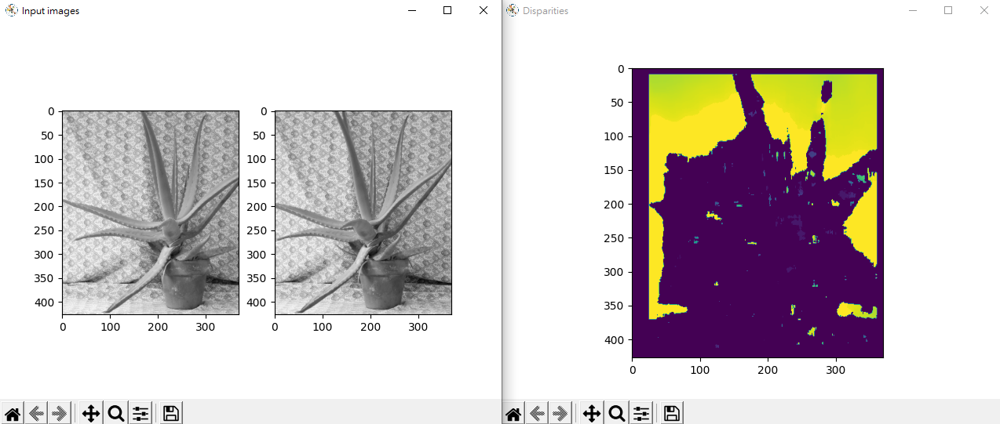

代碼：
```python
# -*- coding: utf-8 -*-

'''
===============================================================================
||   Authors   | 劉啟迪(Qidi Liu)
||-------------|---------------------------------------------------------------
||   License   | Private
||-------------|---------------------------------------------------------------
|| Description | 雙目視覺實現
===============================================================================
'''

__author__ = 'QidiLiu'

import cv2
import os
import numpy as np
import matplotlib.pyplot as plt
from PIL import Image

import sys
sys.path.append('utils')
from utils.workspaces_settings import *
from utils.partial_code_stereo_match import *


def main():
    print('loading image from CSV file')
    imgL = np.genfromtxt('img/aL_gray.csv',delimiter=',').astype(np.float32)
    imgR = np.genfromtxt('img/aR_gray.csv',delimiter=',').astype(np.float32) 
    print(imgL.shape)
    
    plt.clf()
    plt.figure('Input images')
    plt.subplot(1,2,1);plt.imshow(imgL,cmap='gray')
    plt.subplot(1,2,2);plt.imshow(imgR,cmap='gray')

    imgL = np.uint8(imgL)
    imgR = np.uint8(imgR)

    _matcher = cv2.StereoBM_create(16, 21)
    _disparities = _matcher.compute(imgL, imgR)

    plt.figure('Disparities')
    plt.imshow(_disparities)
    plt.show()

    np.savetxt('img/match.csv', _disparities, fmt='%d', delimiter=',', newline='\n') # 保存为csv文件


if __name__ == '__main__':
    os.chdir(WORKING_DIR)
    main()
```

### 3.4 局限性及改進方案

雙目檢測雖然簡單粗暴但是也有很大的局限性，以下是常見的一些容易出錯的場景[^9][^10]。

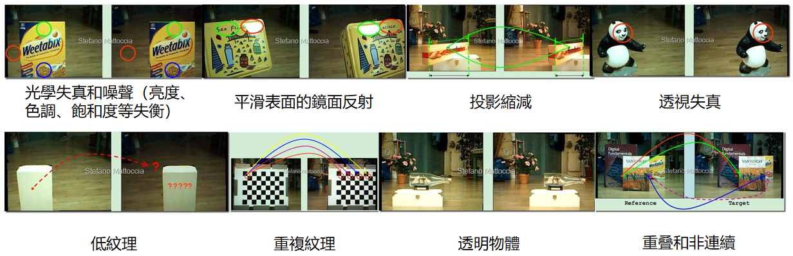

其中，對圖像預先做語義分割可能可以解決透視問題；要解決遮擋問題恐怕必須引入深度學習；要解決低紋理問題，可加一個投影儀，講一個特殊圖案投在目標物體表面（人爲提高紋理度）。

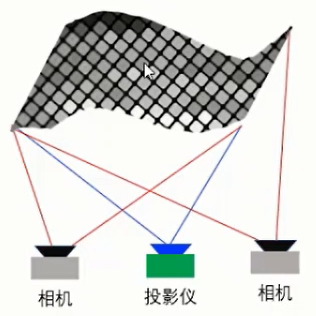

## 4. 結構光3D成像

#### 點光源

安裝激光器射向物體表面，激光在物體上形成的光斑在圖像傳感器上成像。由於激光入射角度和圖像傳感器位置都是可控的（已知的），很容易用幾何關係推算出光斑的位置。

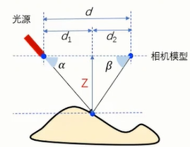

它們的幾何關係如下：

$$ \frac{Z}{tan\alpha} + \frac{Z}{tan\beta} = d $$

換算后可得：

$$ Z = d \cdot \frac{\sin \alpha \cdot \sin \beta}{\sin \cdot (\alpha + \beta)} $$

值得注意的是，$\beta$無法能直接得到，需要用相機焦距和像的物理坐標（注意不是像素位置）算出來。

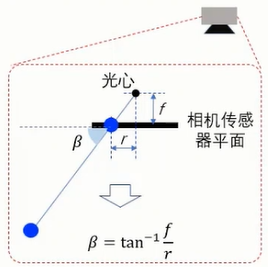

當然，上圖只代表一種相機位置，具體問題要具體分析。

然後，用激光器掃描物體就能獲得多個點的位置。

#### 線光源

用點光源進行逐點掃描效率當然很低，我們可以把點光源換成綫光源。

光綫的本質可用空間點的三個坐標所滿足的一個齊次方程表示。線光源是由多條光綫組成的，就可以用多個齊次方程來表示。換句話説，對下列齊次方程而言，每條光纖對應一組{$A,\,B,\,C,\,D$}。既然綫光源是可控的，這些齊次方程的四個參數就是已知的。

$$ AX + BY + CZ + D = 0 $$

線光源在物體表面上形成的所有光斑在各條光綫上，所以這些光斑位置也滿足這些齊次方程。另外我們還知道，這些光斑與相機形成了針孔相機模型，所以光斑位置與圖像傳感器上像的位置滿足下列數學關係。

$$ X = \frac{xZ}{f} $$
$$ Y = \frac{yZ}{f} $$

代入齊次方程可得：

$$ Z = -\frac{Df}{Ax+By+Cf} $$
$$ X = -\frac{Dx}{Ax+By+Cf} $$
$$ Y = -\frac{Dy}{Ax+By+Cf} $$

其中，$(x,\,y)$是圖像傳感器平面上的點（物理坐標，而非像素坐標），$(X,\,Y,\,Z)$是和$(x,\,y)$對應的空間點（光斑）的位置坐標。

#### 結構光編碼

忍不住感嘆一句，發明結構光編碼的人可真他娘的是個天才。

在下圖的例子裏，機構光投影是6幀不同的條紋，將6幀投影組合后，每個位置都有獨一無二的閃爍編碼（媽的這個設計實在太巧妙了）。

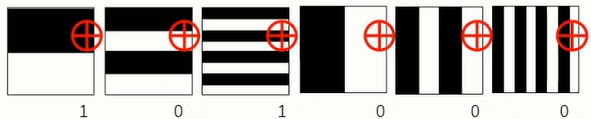

#### 基於條紋投影的3D成像

從固定角度向待測物體投影明暗相間的條紋（條紋亮度呈正弦波分佈）。相機拍到的條紋是扭曲的，從扭曲條紋可以重建物體的3維信息。

通過正弦亮度條紋獲取物體3維信息的原理：沿著亮度正弦分佈的方向去看，物體表面是平面的波形是確定的（正弦波），而在非平面的點亮度分佈的相位會發生突變。通過比較該相位差可得到該點的高度信息。

測量步驟：
1. 校準階段：記錄平面的條紋圖像
2. 測量階段：記錄物體在正弦亮度條紋下的條紋圖像
3. 計算階段：計算每個像素的相位差，換算成高度差

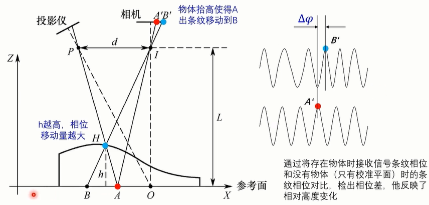

其計算公式是從相似三角形關係推出來的。如下圖所示，相機光心位置$P$、目標點位置$H$和投影儀光心位置$I$形成大三角形，參考點位置$A$、目標點位置$H$和目標點虛位$B$形成小三角形。$L$和$d$是已知的，只要知道$AB$的長就可以求$h$。

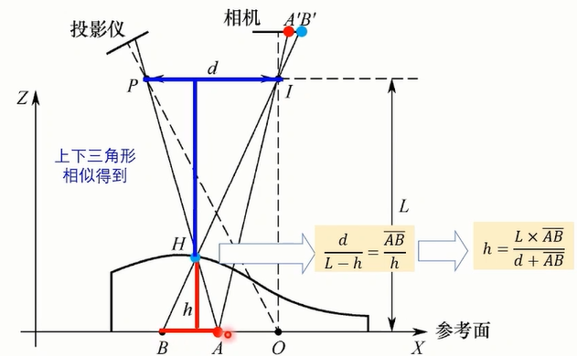

$AB$的求法就複雜了，可以説是爭先亮度條紋測量的核心算法。因爲這部分太多也太雜，我打算在另一篇筆記裏專門總結。

## 5. TOF 3D成像

#### 脈衝TOF

TOF全稱Time of Flight。脈衝TOF系統（PTOF）是由脈衝光源和接收傳感器組成。同一個脈衝從發射出去到反射回來有個時間差，這個時間差乘上光速就是光走完全程的路程，入射與反射距離相等的話，把路程除以2就是傳感器/光源到物體表面反射點的距離。

$$ d = \frac{c\Delta t}{2} $$

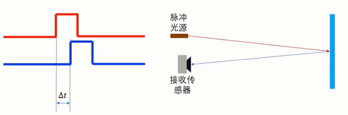

接收到的脈衝信號其實挺差的。一種優化的方法是計算接受波形的積分值，用積分值推算時間差。（這種方案的優勢還在於，積分計算很容易用電容實現，成本並不高）

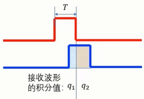

從圖中很容易得出$\delta t = T \cdot \frac{q_2}{q_1+q_2}$，將其代入上面的公式可得：

$$ d = \frac{cTq_2}{2\cdot(q_1 + q_2)} $$

#### 正弦波TOF

一個更優雅的優化方案是放棄脈衝，改用正弦波（幅度調製）。之前用脈衝只能算一個特定時間點的時間差，而用正弦波上的每一點都能用來算時間差（理論上講），因爲用正弦波就能用相位差推時間差。

在實際的應用中，我們用4個相位（間隔$\frac{\pi}{2}$）的點計算相移，该算法也叫四步相移法。

相位差測量方法：
1. 發射幅度調製的正弦波激光到物體表面，信號幅度如下；
    $$ g_\theta (t) = \cos(\omega t + \theta) $$
2. 將接收信號$r(t)$與參考信號相乘並計算其積分，結果記爲$s_\theta$；
    $$ s_\theta = \displaystyle\lim_{t\rightarrow \infty} \frac{1}{t} \int_{-\frac{t}{2}}^\frac{t}{2} r(t) g_\theta(t)dt = \frac{a}{2}\cos(\phi + \theta) $$
3. 每隔$\frac{\pi}{2}$記錄一次$s_\theta$，記錄四次，也就是說，四個信號的相移$\theta$分別為$0,\,0.5\pi,\,\pi,\,1.5\pi$；
4. 把這四個$s_\theta$代入下列公式，計算出的$\phi$即接收信號與發射信號之間的相位差，再根據信號頻率把相位差轉換爲時間差，然後就能求光綫走過的旅程了。
    $$ \phi = atan(\frac{s_{1.5\pi} - s_{0.5\pi}}{s_0 - s_\pi}) $$

計算相關值的過程相當於一個帶通濾波器，提高了信噪比。

然而，如果兩個點間隔正好對應正弦信號的一個周期，那計算得到的相位差就是一樣的，顯然會導致無效的測量，所以信號頻率對應著測量範圍。頻率越低，測量範圍越長，然而同時測量分辨率也越低。一種解決方案是用兩種不同的頻率測量，這樣等效的調製頻率變爲兩個頻率的最大公約數，不容易出現無效測量。

單點測量顯然不適合大部分應用場景，市面上的TOF相機用紅外信號與濾光器提高信噪比並擴大測量範圍，而且在硬件方面也做了優化（集成了相關值的計算）。

## 6. 圖像畸變與校正

#### 鏡頭校正原理

光學鏡頭會帶來圖像失真（桶形失真和枕形失真）。

用棋盤格圖可以做像素修正，得到下列調整公式的畸變係數$k_1,\,k_2,\,k_3,\,p_1,\,p_2$（加號前描述徑向位移，加號后描述切向位移）：
$$
\left[\begin{array}{c}
    x_{corr} \\
    y_{corr} \\
\end{array}\right]
=
(1 + k_1 r^2 + k_2 r^4 + k_3 r^6) \cdot
\left[\begin{array}{c}
    x \\
    y \\
\end{array}\right]
+
\left[\begin{array}{c}
    2 p_1 x y + p_2 \cdot (r^2 + 2x^2) \\
    p_1 \cdot (r^2 + 2y^2) + 2 p_2 x y
\end{array}\right]
$$

其中$(x,\,y)$是帶有失真的像素坐標，$(x_{corr},\,y_{corr})$是修正後的像素坐標值，$r$是像素到圖形中心距離。

#### OpenCV的鏡頭校正函數

用findChessboardCorners()和cornerSubPix()得到棋盤格角點的坐標（imgpoints），用棋盤格點在物理世界中的真實坐標objpoints和從相機得到的棋盤格角點坐標imgpoints輸入畸變係數計算函數calibrateCamera()便可得到畸變係數，在使用該相機時將輸入圖像用畸變係數做修正（可用OpenCV函數undistort()來算）就得到了校正后的圖像。

findChessboardCorners()
查找棋盤角點位置[^13]。函數返回布爾變量表示找沒找到棋盤角點。
```cpp
bool cv::findChessboardCorners	(	InputArray 	image,
    Size 	patternSize,
    OutputArray 	corners,
    int 	flags = CALIB_CB_ADAPTIVE_THRESH+CALIB_CB_NORMALIZE_IMAGE 
    )	
```
```python
cv.findChessboardCorners(image, patternSize[, corners[, flags]]	) -> retval, corners
```
- image: 源圖像。必須是8位的灰度圖或彩色圖
- patternSize: 每行和每列的内角數($w$, $h$)。$w$是棋盤每行的黑白塊數量-1，$h$是棋盤每列的黑白塊數量-1
- corners: 檢測到的角點的輸出數組
- flags: 可以是0，或下列值的結合（用的時候直接相加，如CALIB_CB_ADAPTIVE_THRESH+CALIB_CB_NORMALIZE_IMAGE）
    - CALIB_CB_ADAPTIVE_THRESH: 使用自適應閾值
    - CALIB_CB_NORMALIZE_IMAGE: 算閾值前先用equalizeHist直方圖對圖像做標準化處理
    - CALIB_CB_FILTER_QUADS: 使用額外的標準（如輪廓面積、周長、正方形形狀）過濾掉輪廓檢索階段提取到的錯誤四邊形
    - CALIB_CB_FAST_CHECK: 事先進行棋盤角點的快速檢查，如果沒找到就回個信。有了這種機制，沒有棋盤的時候就可以更快地退出

cornerSubPix()
角點位置的亞像素級校正。一般有兩種算法，用圖像灰度梯度或用綫性插值，OpenCV用的是前一種[^14][^15][^16]。
```cpp
void cv::cornerSubPix	(	InputArray 	image,
    InputOutputArray 	corners,
    Size 	winSize,
    Size 	zeroZone,
    TermCriteria 	criteria 
    )	
```
```python
cv.cornerSubPix(image, corners, winSize, zeroZone, criteria	) -> corners
```
- image: 單通道輸入圖像，8位圖或浮點圖
- corners: 角點的初始坐標（粗坐標）
- winSize: 搜索窗邊長的一半（比如，winSize設爲(5, 5)，則搜索窗大小為(5*2+1)×(5*2+1) = 11×11）
- zeroZone: 給搜索窗設置一個死區，這個變量是死區變長的一半，尺寸關係類似與winSize。死區的意思好像相當於一個反向mask，即離待校正點近的區域不做計算（文檔沒太看懂，這是我個人的理解，不太確定對不對，請懂的朋友多多指教）
- criteria: 角點位置校正的迭代標準。由三個數組成(int type, int maxCount, double epsilon)，其中，maxCount是最高迭代次數，epsilon是想要的精度，type可設為COUNT, EPS或COUNT+EPS
    - COUNT(或MAX_ITER): 按最高迭代次數
    - EPS: 按精度算
    - COUNT+EPS: 文檔沒解釋，可能是倆標準做一個或運算，即不管那種標準到了都停

calibrateCamera()
用校準圖像的特徵找出相機的内參數和外參數[^17][^18][^19]。函數返回值是重投影的總的均方差。
```cpp
double cv::calibrateCamera	(	InputArrayOfArrays 	objectPoints,
    InputArrayOfArrays 	imagePoints,
    Size 	imageSize,
    InputOutputArray 	cameraMatrix,
    InputOutputArray 	distCoeffs,
    OutputArrayOfArrays 	rvecs,
    OutputArrayOfArrays 	tvecs,
    OutputArray 	stdDeviationsIntrinsics,
    OutputArray 	stdDeviationsExtrinsics,
    OutputArray 	perViewErrors,
    int 	flags = 0,
    TermCriteria 	criteria = TermCriteria(TermCriteria::COUNT+TermCriteria::EPS, 30, DBL_EPSILON) 
    )		

double cv::calibrateCamera	(	InputArrayOfArrays 	objectPoints,
    InputArrayOfArrays 	imagePoints,
    Size 	imageSize,
    InputOutputArray 	cameraMatrix,
    InputOutputArray 	distCoeffs,
    OutputArrayOfArrays 	rvecs,
    OutputArrayOfArrays 	tvecs,
    int 	flags = 0,
    TermCriteria 	criteria = TermCriteria(TermCriteria::COUNT+TermCriteria::EPS, 30, DBL_EPSILON) 
    )	
```
```python
cv.calibrateCamera(	objectPoints, imagePoints, imageSize, cameraMatrix, distCoeffs[, rvecs[, tvecs[, flags[, criteria]]]]) -> retval, cameraMatrix, distCoeffs, rvecs, tvecs

cv.calibrateCameraExtended(	objectPoints, imagePoints, imageSize, cameraMatrix, distCoeffs[, rvecs[, tvecs[, stdDeviationsIntrinsics[, stdDeviationsExtrinsics[, perViewErrors[, flags[, criteria]]]]]]]) -> retval, cameraMatrix, distCoeffs, rvecs, tvecs, stdDeviationsIntrinsics, stdDeviationsExtrinsics, perViewErrors
```
- objectPoints: 校正標準。雖然是個3維向量，但只包含x和y的坐標，z坐標被設爲0。特徵數量與從校準圖像找出的特徵數量應一致。比如用棋盤檢測的話，棋盤有多少角點，這裏就得做多少標準點
- imagePoints: 輸入特徵，即從校準圖找出的特徵
- imageSize: 圖像尺寸，用於初始化相機内參
- cameraMatrix: 相機内參矩陣，是一個3×3浮點型的矩陣
- distCoeffs: 校正參數數列，順序是$k_1,\,k_2,\,p_1,\,p_2,[\,k_3,[\,k_4,\,k_5,\,k_6,[\,s_1,\,s_2,\,s_3,\,s_4,\,[\tau_x,\,\tau_y]]]]$，它可以有4個、5個、8個、12個或14個元素。
- rvecs: 旋轉向量
- tvecs: 位移向量
- stdDeviationsIntrinsics: 内參的標準偏差向量，順序是$f_x,\, f_y,\, c_x,\, c_y,\, k_1,\,k_2,\,p_1,\,p_2,\,k_3,\,k_4,\,k_5,\,k_6,\,s_1,\,s_2,\,s_3,\,s_4,\,\tau_x,\,\tau_y$，缺失的量的偏差為0。
- stdDeviationsExtrinsics: 外參的標準偏差向量，如果只有一個校正特徵視圖（只有一個相機），順序是$R,\,T$，如果有多個，就是$R_0,\,T_0,\,R_1,\,T_1,\,R_2,\,T_2,\,...$
- perViewErrors: 各個校正圖像的重投影均方差的輸出向量
- flags: 校正方法，可以是0，或以下各項的組合，組合是直接用“+”連接，内容賊多，我簡單記一下，先不看詳細的原理了
    - CALIB_USE_INTRINSIC_GUESS: 使用輸入的相機内參作爲粗略估計的初始相機内參
    - CALIB_FIX_PRINCIPAL_POINT: 固定光軸點，光軸點將保持為圖像的中心點
    - CALIB_FIX_ASPECT_RATIO: 固定比值fx/fy，只對fy進行優化計算
    - CALIB_ZERO_TANGENT_DIST: 切向畸變係數($P_1,\,P_2)被設置爲0並保持為0
    - CALIB_FIX_FOCAL_LENGTH: 固定焦距$f$
    - CALIB_FIX_K1,..., CALIB_FIX_K6: 固定對應的畸變參數
    - CALIB_RATIONAL_MODEL: 使用理想模型，計算8個校正參數
    - CALIB_THIN_PRISM_MODEL: 使用薄棱鏡畸變模型，計算12個校正參數
    - CALIB_FIX_S1_S2_S3_S4: 固定薄棱鏡畸變模型的最后4個參數
    - CALIB_TILTED_MODEL: 使用傾斜模型，計算14個校正參數
    - CALIB_FIX_TAUX_TAUY: 固定傾斜模型的最後兩個參數
- criteria: 迭代的終止標準（詳見上面cornerSubPix()的同名參數）

#### 深度相機的矯正

有些深度相機輸出的數據是目標點到鏡頭的距離，而我們想要的深度圖記錄的是目標點到鏡頭所在平面的距離，於是目標點離畫面中心越遠，獲取的深度數據就越不准。對於這種相機我們需要先根據目標點偏離中心的角度將目標點到鏡頭的距離換算爲深度數據，換算原理和公式見下圖。

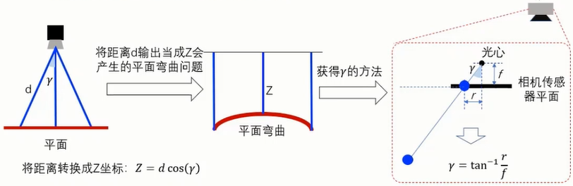

## 7. RGB-D融合概述

將深度數據與顔色數據融合可在應用中使用更多信息。

在實際應用中，深度相機與普通相機同時對同一目標拍攝，將深度信息經旋轉後融入普通相機的對應像素中。原理和計算公式如下圖所示。

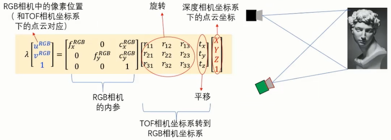

[^1]: https://college.aiimooc.com/preview/725 3D感知技术与实践
[^2]: https://zhuanlan.zhihu.com/p/509925981 知乎 - 【缺陷檢測】2.4 模板匹配
[^3]: https://zhuanlan.zhihu.com/p/31243203 知乎 - 立体匹配算法（Stereo Matching）及其在OpenCV中的应用
[^4]: https://blog.csdn.net/opencv_fjc/article/details/95482437 CSDN - SAD算法原理及其实现
[^5]: https://blog.csdn.net/Anderson_Y/article/details/81698893 CSDN - 立体匹配(Stereo Matching)
[^6]: https://zhuanlan.zhihu.com/p/50801189 知乎 - OpenCV双目稠密匹配BM算法源代码详细解析
[^7]: https://blog.csdn.net/CipherPolzz/article/details/122349550 CSDN - opencv StereoBM函数各个参数的含义
[^8]: https://cloud.tencent.com/developer/article/1065819 騰訊雲 - OpenCV3.4两种立体匹配算法效果对比
[^9]: https://blog.csdn.net/chenyusiyuan/article/details/5967291 CSDN - OpenCV学习笔记（18）双目测距与三维重建的OpenCV实现问题集锦（三）立体匹配与视差计算
[^10]: https://www.cnblogs.com/grandyang/p/5805261.html 博客園 - OpenCV 3.1 StereoBM 获取正确视差Dispariy
[^11]: http://vision.deis.unibo.it/~smatt/Seminars/StereoVision.pdf University of Bologna - StereoVision.pdf
[^12]: https://blog.csdn.net/KinboSong/article/details/72918432 CSDN - opencv StereoBM各个参数的意义
[^13]: https://docs.opencv.org/4.x/d9/d0c/group__calib3d.html#ga93efa9b0aa890de240ca32b11253dd4a OpenCV - findChessboardCorners()
[^14]: https://docs.opencv.org/4.x/dd/d1a/group__imgproc__feature.html#ga354e0d7c86d0d9da75de9b9701a9a87e OpenCV - cornerSubPix()
[^15]: https://docs.opencv.org/4.x/dd/d92/tutorial_corner_subpixels.html OpenCV - Detecting corners location in subpixels
[^16]: https://blog.csdn.net/weixin_41695564/article/details/79991733 CSDN - OpenCV学习笔记（十二）——亚像素角点检测
[^17]: https://docs.opencv.org/4.5.5/d9/d0c/group__calib3d.html#ga3207604e4b1a1758aa66acb6ed5aa65d OpenCV - calibrateCamera()
[^18]: https://zhuanlan.zhihu.com/p/41152930 知乎 - 一分钟详解OpenCV相机标定calibrateCamera
[^19]: https://docs.opencv.org/4.5.5/dc/dbb/tutorial_py_calibration.html OpenCV - Camera Calibration
[^20]: https://stackoverflow.com/questions/70751242/difference-of-termcriteria-type-in-opencv-count-and-max-iter stackoverflow - Difference of TermCriteria type in OpenCV : COUNT and MAX_ITER
