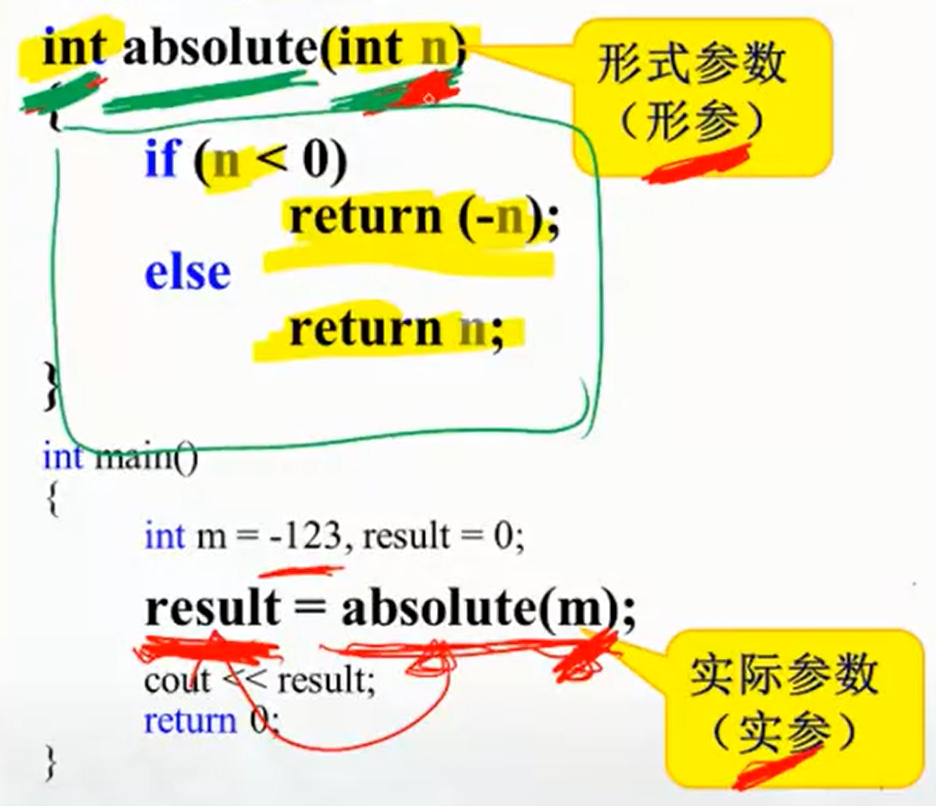
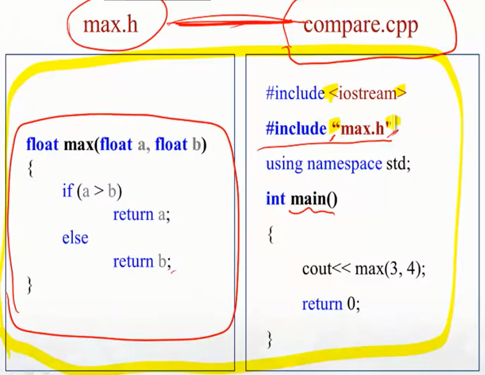
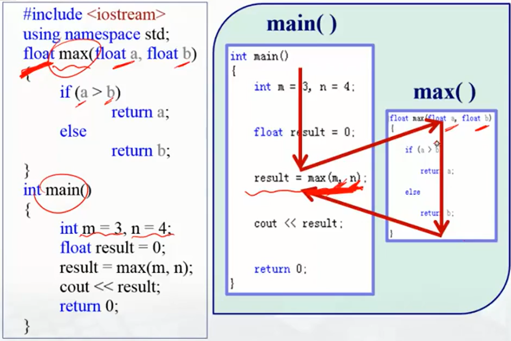
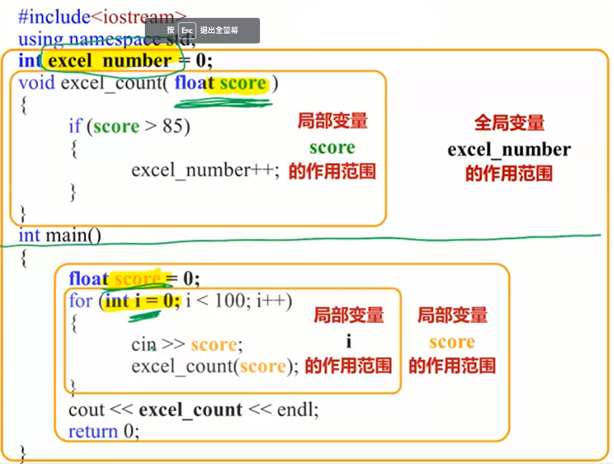
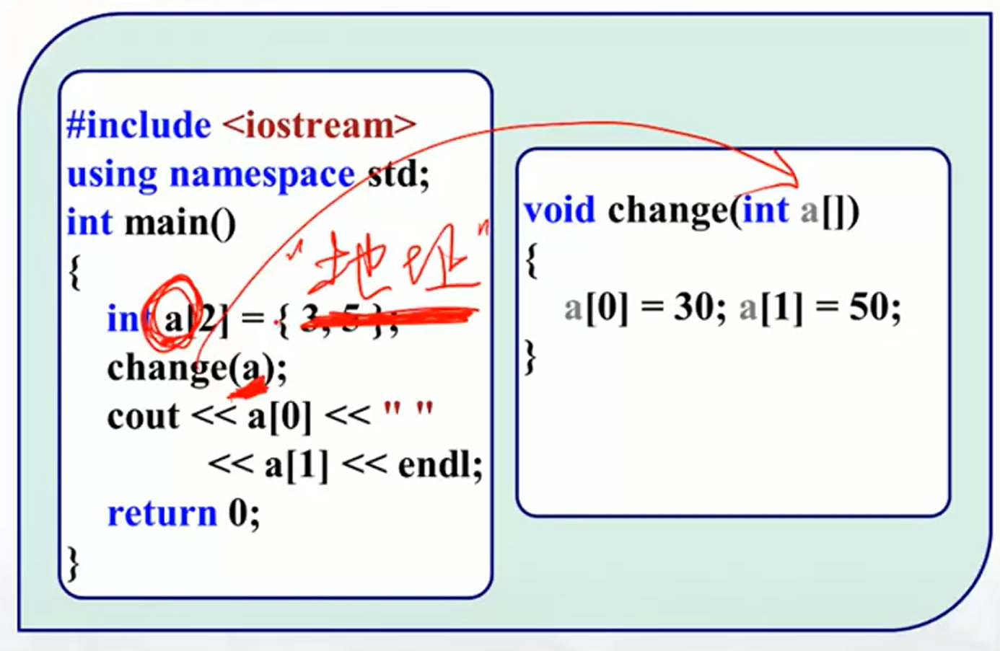

本筆記大部分内容來自北大信科李戈老師在Coursera上的課程《C程序設計進階》[^1]。

## 1. 函數的定義

#### 基本結構

C/C++中函數的定義和調用如下所示（形參指形式參數，實參指實際參數)：
```cpp
<返回類型> <函數名>(<形參類型> n)
{
    <函數體>
    return <返回值>; // 返回指令是函數體的一部分
}

int main()
{
    <程序主體>
    <某變量> = <函數名>(<實參>);
}
```

參數即函數輸入。實參與形參不一定要同名，但函數體裏的輸入必須用形參表示。



#### 函數庫的引用

一個源文件下可定義多個函數，不過爲了更條理，也可以把某些函數寫到與main.cpp文件同目錄下的.h文件（頭文件）裏，只需在main.cpp的開頭將其包含（include）即可。



include后跟的頭文件有的用尖括號，有的用雙引號。區別是：**用尖括號時**編譯器會從**系統文件**中找，**用雙引號時**編譯器會**先從用戶目錄**中找，然後再到**C++的安裝目錄**找，最後才去**系統文件**中找[^2]。

#### 函數定義的位置

main()函數是程序的入口。最好把函數定義在main()函數之前，如果非要放在main()函數之後，必須在main()之前寫一下定義，這是寫給編譯器看的（編譯器從上往下編譯）。

## 2. 函數的調用過程

main()函數是程序的入口，在程序被執行時，計算機先把main()函數寫入内存，從頭開始運行。儅運行到需要調用函數時，系統會把函數寫入内存，把實參傳給形參，開始運行函數，運行完畢把返回值傳給内存中的main()函數，然後釋放運行完畢的函數所占的内存，並繼續運行内存中的main()函數。



值得注意的是，就算實參變量名與形參變量名一致，這兩個變量也是各自獨立的，用上圖就可以理解：它們運行在不同的内存空間中，實參只作用在main()函數内，形參只作用在所屬函數内。

## 3. 局部變量與全局變量

- 局部變量：在函數内或塊内定義，只在這個函數或塊内起作用的變量；
- 全局變量：在所有函數外定義的變量，它的作用域是從定義變量的位置開始到本程序文件結束。



當全局變量與局部變量同名時，局部變量將在自己作用域内有效，它將屏蔽同名的全局變量。但**爲了程序可讀，盡量別讓他們重名**。一個最基本的區分方法是**把全局變量命名爲完全大寫的形式**。雖然我們分的時候只分為全局變量和局部變量，但其實還有種介於兩者之間的類型——main()函數的局部變量，可以把它們搞成全局變量（在main()函數之外定義），也可以在名字前加個前綴“main_”。

## 4. 數組名做參數

數組作爲參數時，形參名跟數組名類似，要跟一對方括號，但是數組長度可以不寫。

```cpp
void change(int a[])
{
    a[0] = 30; a[1] = 50;
}
```

!!!注意，**與普通變量不同，數組名代表的是數組地址**，所以**被傳入形參的是數組地址，而非數組内容**，於是作爲參數的數組在函數内被改變時是天然的全局變量，此時形參與實參指的是**同一個數組**，所以**在函數内改動形參數組也會導致實參數組被改變**。



## 5. 函數作用

函數的本質是對步驟的封裝。理論上講所有程序都能被重構為僅有單一的main()函數的形式（我猜的）。但儅一些步驟被封裝為函數，這些步驟可以被更容易地重複使用，可讀性也更高，所以本質上，這是一種**把縂功能分爲子功能組合的思想**。但在實際使用過程中容易發現，函數并不總能提高可讀性：**如果分得過細，或使用了過多的全局變量，可讀性可能不降反增**。

[^1]: https://www.coursera.org/learn/c-chengxu-sheji Coursera - C程序设计进阶
[^2]: https://zhuanlan.zhihu.com/p/161049759 知乎 - #include使用引号“”和尖括号<>的区别？