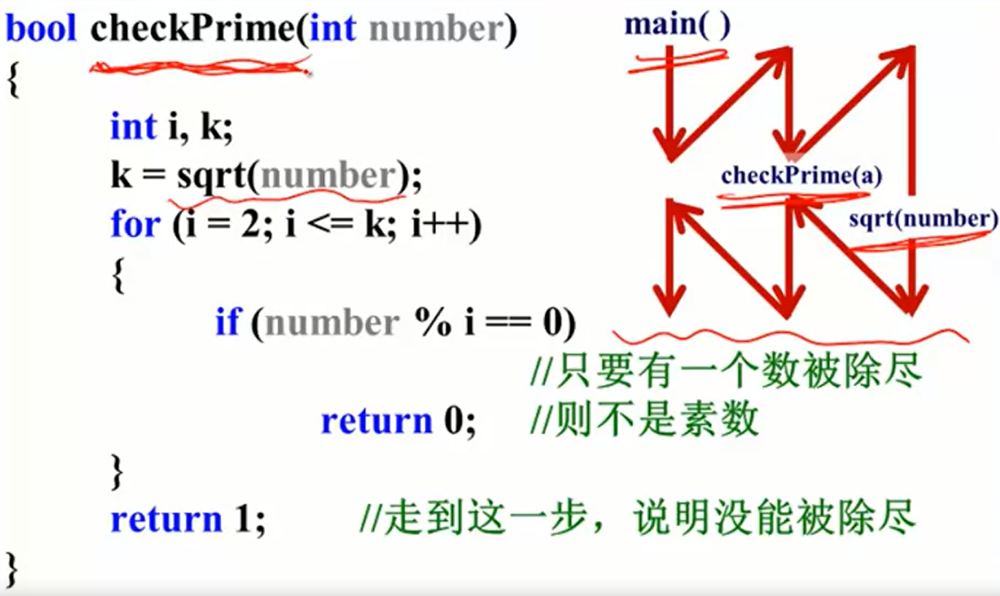
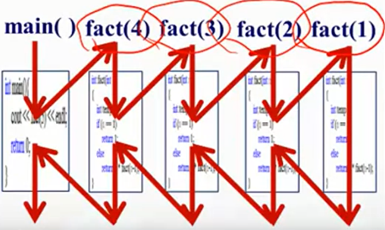

本筆記大部分内容來自北大信科李戈老師在Coursera上的課程《C程序設計進階》[^1]。

## 1. 遞歸的定義

函數可以進行嵌套調用（如下圖），但不可以嵌套定義。函數**自己調用自己的“克隆體”**的時候，叫**遞歸**。



之所以强調**克隆體**，是因爲函數在做遞歸調用時在内存中開辟了一塊新的空間，執行的是一個雖然與原函數一模一樣但是獨立運行的函數。



值得注意的是，遞歸調用前的命令是按從上到下（從Master到Slave）的順序執行的，而遞歸調用後的命令時從下到上（從Slave到Master）的順序執行的。

説實話我想象不到工程實踐中有什麽操作是遞歸能做，而用“循環+條件判斷”解決不了的。看起來遞歸在一些算法問題上能更簡潔地解決問題（相比循環），但代價是降低了程序的可讀性（也可能我理解得還不夠透徹，歡迎指正）。

## 2. 應用實例

#### 切餅

```cpp
int q(int n)
{
    if (n == 0)
        return 1;
    else
        return n + q(n-1);
}
```

#### 費波那契数列

```cpp
int f(int n)
{
    if (n == 1)
        return 1;
    else if (n == 2)
        return 1;
    else
        return f(n-1) + f(n-2);
}
```

[^1]: https://www.coursera.org/learn/c-chengxu-sheji Coursera - C程序设计进阶