本筆記大部分内容來自北大信科李戈老師在Coursera上的課程《C程序設計進階》[^1]。

## 1. 指針的定義

内存裏所有的存儲空間都有自己的地址，變量的地址一般是起始地址。通常把某個變量的地址稱爲**指向該變量的指針**。注意，**指針**和**指針變量**不是同一個概念。可以用**取地址運算符“&”**取出變量所在的地址（指針）。
```cpp
int a;
cout << &a << endl;
```

變量名、變量地址和變量的值被稱爲變量三要素。

可用sizeof()求出指針的長度。
```cpp
cout << sizeof(&a) << endl;
```

有了指針后，我們可以拿指針訪問變量的值，由**指針運算符“\*”**實現。
```cpp
cout << *&a << endl;
cout << a << endl; // 與上一行是等效的
```

## 2. 指針變量

#### 指針變量的定義

可以定義一個變量來存放指向某變量的指針，**用於存放指針的變量叫指針變量**。

定義指針變量可用以下語句實現。
```cpp
<基類型> * <指針變量的名字>;
```

**基類型**是指針變量指向的變量的類型。

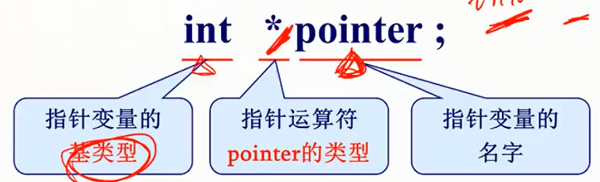

用**取地址運算符&**可以將變量的指針取出來賦給指針變量。
```cpp
int a = 76;
int * pointer;
pointer = &c;
```

#### 指針變量的使用

用**指針運算符\***可訪問指針變量所指向的變量的内容，也就是説可以把 **\*pointer** 當作 **a** 使用，比如可以用來讀取 a 的值，也可以用來給 a 賦值。

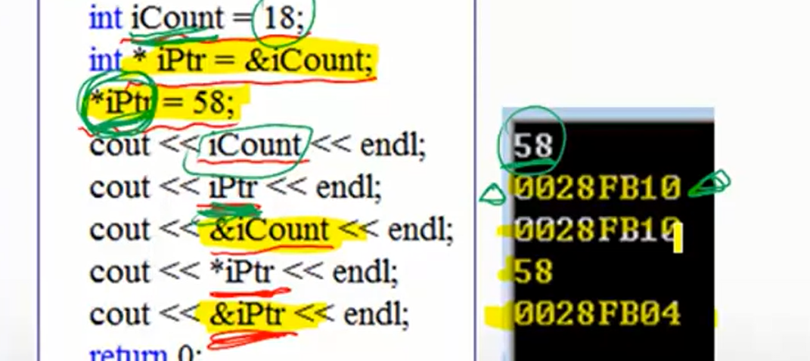

取地址運算符&和指針運算符\*的運算優先級高於算術運算符。

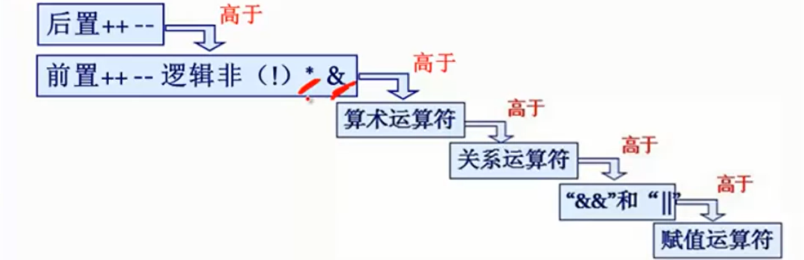

李戈老師在這裏舉的例子是 \*pointer++ 不等同於 (\*pointer)++ 。前者相當於 a++ (假設pointer指向a)，而後者表示先動指針變量再訪問指針變量所指向的變量。

上面的例子裏對指針變量進行了++運算，與一般變量不同，儅指針變量被++或--時，電腦會根據基變量來判斷被指變量的類型在内存中所占的字節，進而讓指針變量指向内從中上一個或下一個變量。（但我不是很懂，如果緊挨著的上一個變量是個長短不同的變量怎麽辦？）

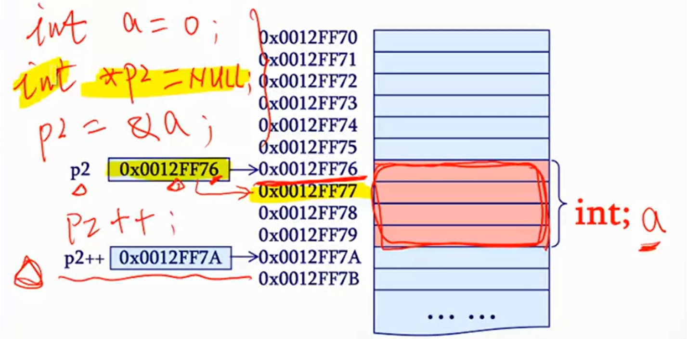

## 3. 指針與數組

#### 數組名相當於指向數組第一個元素的指針

當指針變量**指向數組元素**時，訪問 \*<指針變量> 相當於訪問被指的數組元素（與指向普通變量沒區別）。

當指針變量**指向數組名**時（工程實踐中沒啥用）， 由於**數組名相當於指向數組第一個元素的指針**，所以指針指向的是數組第一個元素的地址（即指向指針的指針）。 順便一提定義這種套娃指針可以用基變量和兩個星號[^2]。
```cpp
int ival = 1024;
int *pi = &ival; //pi point to ival
int **ppi = &pi; //ppi point to pi
```

比起指向數組名的指針，更常見的是**針對數組名的操作**。如果數組是char類型，用cout輸出數組名會顯示字符串。而當數組不是char類型時，用cout輸出數組名會顯示數組第一個元素的地址。用指針運算符\*對數組名進行運算相當於訪問第一個元素。

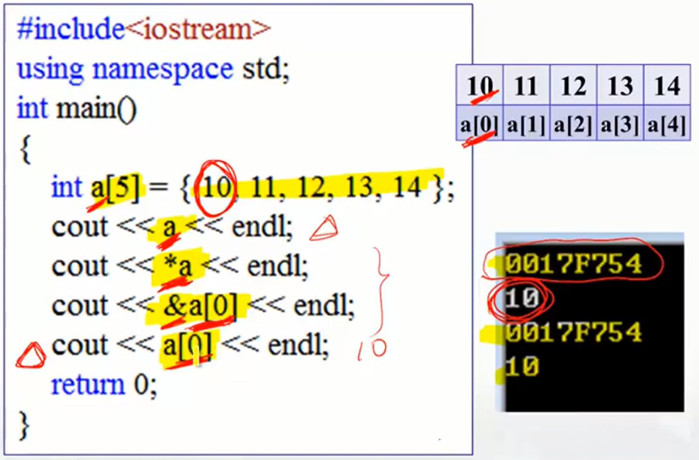

關於指針名，李戈老師還提了一點，在C語言的國際規範中，數組名不完全算是指針，只有數組名沒有被sizeof、Alignof、&這些運算符操作時，才被轉換爲指向第一個元素的指針。所以老師强調了下：准確地講是**相當於**指針，不能説**是**指針。重複一下這句話：

**數組名相當於指向數組第一個元素的指針。**

#### 用指針變量訪問數組元素

用指針變量能更方便訪問數組。在下面的例子中，由於後置++只會在執行後改變變量的值，所以會從a[0]開始輸出。

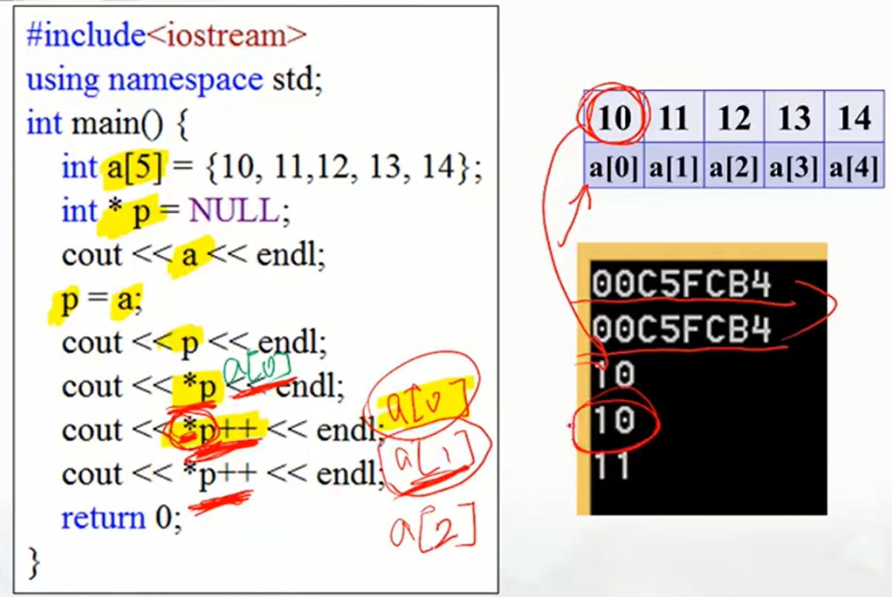

值得注意的是，因爲當我們用指針變量訪問數組元素時**指針變量會發生改變**，有可能會將指針指向數組之外的範圍導致出錯。所以**在對指針變量做加減運算時一定要注意有效的範圍**。

#### 指向二維數組的指針

當我們在内存中保存二維或多維數組時，數組實際上是以一維數組的形式保存的，所以用指針訪問二維或多維數組會很方便。

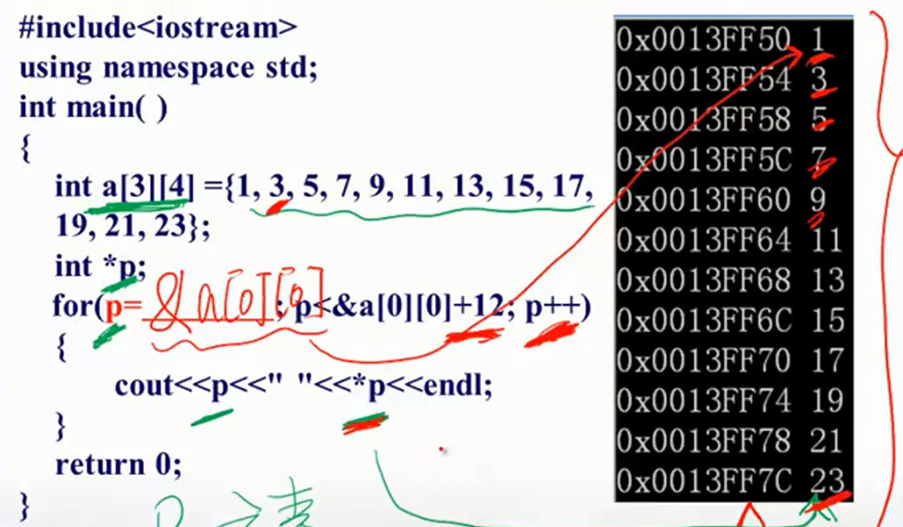

值得注意的是，上圖中的指針指向的是**數組元素**，而非數組名。當我們定義二維數組時，數組名相當於第一個元素，即一個**包含四個int型元素**的一維數組，的指針。所以如果我們想**定義指向二維數組的指針變量**，那麽該指針變量的**基類型**也應該是**包含4個int型元素的一維數組**。
```cpp
int (* p)[4];
```

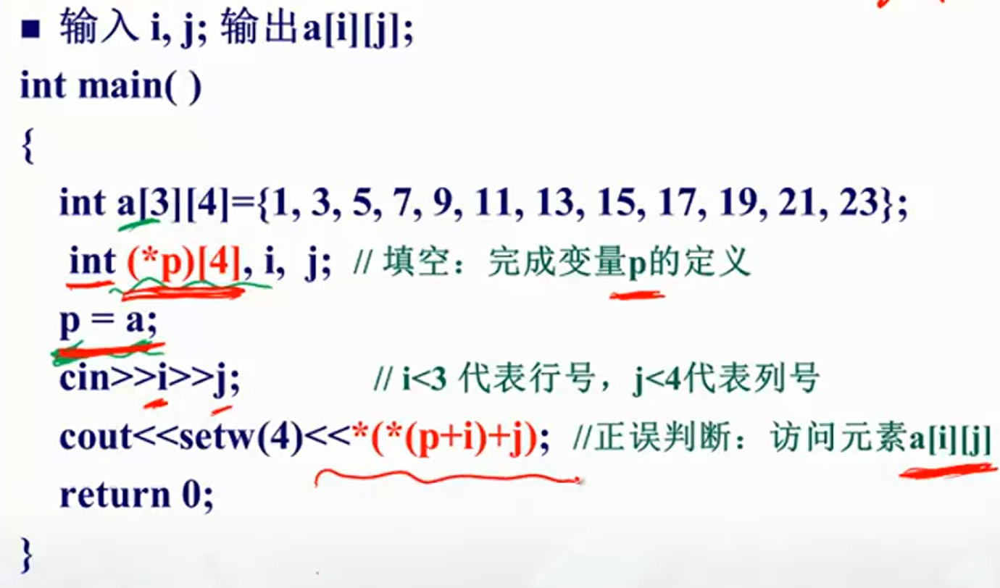

上圖中這個\*(\*(p+i)+j)等效於a[i][j]。對於數組名a和指向它的指針p，在新的C語言標準裏，p[i]相當於a[i]，p[i][j]相當於a[i][j]。

#### 字符串的特殊性

char型數組（又稱字符串）有很多騷操作，除了cout會針對char型數組直接輸出内容之外，char型指針變量還能直接指向一個字符串常量。雖然你不能改這個字符串常量，但是如果能滿足使用需求，這種特別的使用方式會極大提高可讀性。除此之外，你甚至可以把字符串的數組名直接賦到char型指針變量上，進而輸出這個字符串。

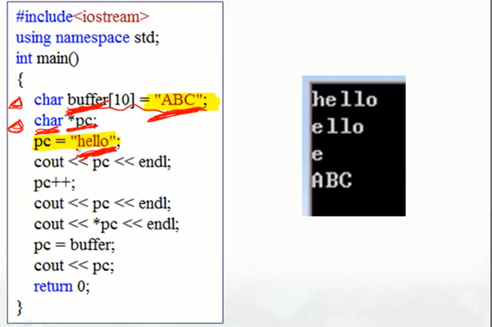

#### 二維數組的地址

- 數組名相當於指向數組第一個元素的指針
- **&E**相當於把E的管轄範圍**上升了**一個級別，比如對二維數組int a[m][n]來説a指第一行，而&a指整個二維數組
- **\*E**相當於把E的管轄範圍**下降了**一個級別，比如對二維數組int a[m][n]來説a指第一行，而\*a指第一行第一個元素。

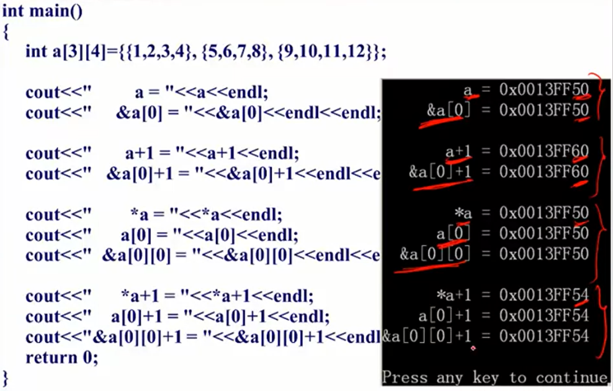

## 4. 指針與函數

#### 指針變量作爲函數輸入

將指針變量輸入函數，就能在函數内直接訪問函數外的變量（實現類似全局變量的效果），看起來方便，但不一定是好事，還是那句話，給函數過多外部訪問的渠道可能會降低代碼的易讀性。

爲了“限制”函數中指針變量的功能（去掉指針變量**修改**被指變量的能力），我們可以在定義形參時給它**加個const前綴**，使它變成指向符號常量的指針變量。值得注意的是，雖然這種指針變量改不了所指變量的内容（對該指針而言變量已成常量），但**可以改變它的指向**（使它指向另一個變量）。

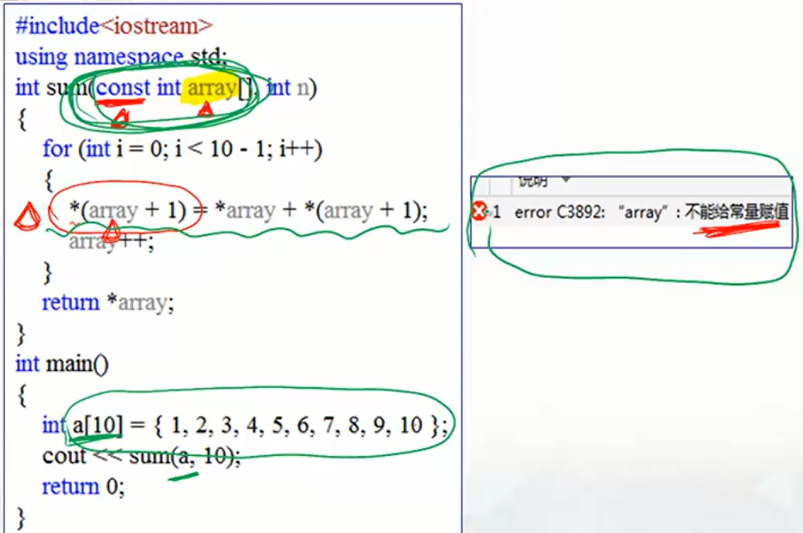

#### 指針變量作爲函數輸出

定義指針類型數據的函數：
```cpp
<基類型> * <函數名>(<參數類型> <形參名>, ...)
{
    <函數體>
}
```

下面的例子裏，函數get()接收一個二維數組和兩個坐標，返回二維數組中指向指定坐標的指針變量。

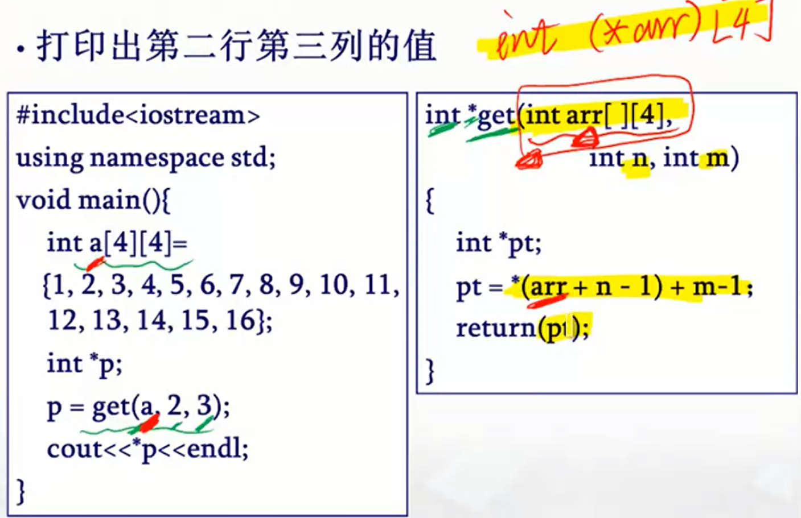

值得注意的是，如果返回的指針變量**指向的是函數的局部變量**，等函數執行完函數所占内存就被釋放掉了，那這個指針變量指向哪就沒啥意義了，所以**別這樣乾**。


#### 靜態局部變量

在函數中可定義靜態局部變量，與一般局部變量不同，靜態局部變量的值在**函數執行結束后被保留**，即其占用的内存不釋放，在下一次調用該函數時，仍可繼續使用該變量。定義時只要在前面加個static就可以。
```cpp
static <變量類型> <變量名> = ...;
```

[^1]: https://www.coursera.org/learn/c-chengxu-sheji Coursera - C程序设计进阶
[^2]: https://vinesmsuic.github.io/2019/08/14/c++-pointer/#%E4%BE%86%E7%9C%8B%E4%B8%80%E5%80%8B%E5%B0%8F%E4%BE%8B%E5%AD%90-2 Vines' Note - C++ Pointers 教學