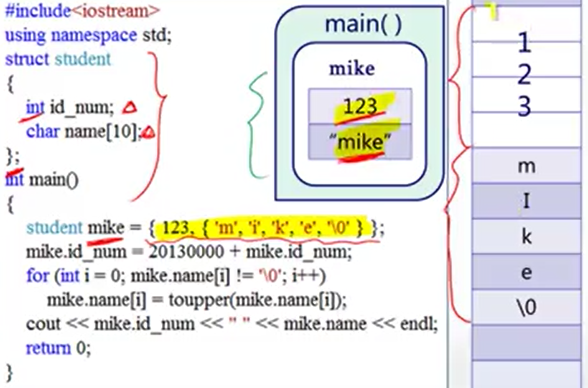
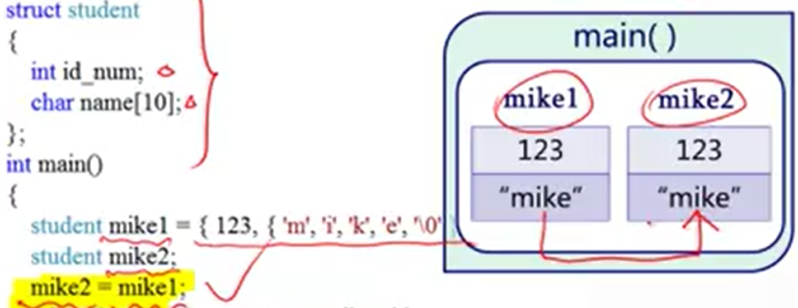
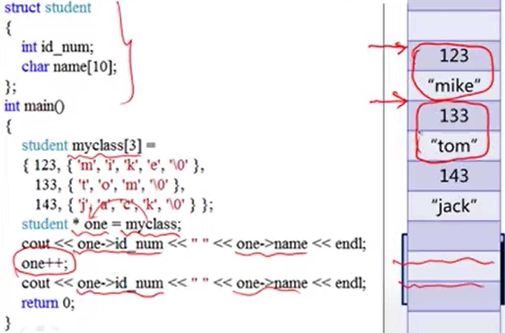

本筆記大部分内容來自北大信科李戈老師在Coursera上的課程《C程序設計進階》[^1]。

## 1. 結構體的定義和變量的創建

**結構體**方便我們用一組變量來描述同一個“事物”。用命令struct和大括號可定義一個結構體。值得注意的是，定義結構體時結尾要加分號。
```cpp
struct struct_student
{
    int id_num;
    char name[10];
};
```

用結構體名可創建該結構體類型的新變量。
```cpp
struct_student student_1 = {123, {'m', 'i', 'k', 'e', '\0'}};
```

另一個方式是在定義結構體時聲明該結構體類型的新變量，直接把變量名跟在定義后就行。
```cpp
struct struct_student
{
    int id_num;
    char name[10];
} student_1, student_2;
```

與數組一樣，結構體在創建時也在内存中占用一塊連續的内存空間。



## 2. 結構體變量的賦值

C++中用“.”表示結構體變量與其從屬變量之間的從屬關係，訪問結構體下的變量用“.”。
```cpp
struct_student student_2 = {996, {'t', 'o', 'n', 'y', '\0'}};
student_2.id_num = 955;
cout << student_2.id_num << " " << student_2.name << endl;
```

與數組不同的是，我們可以把一個結構體變量賦值給一個新的結構體變量，此操作會讓變量内容也被複製過去，跟一般變量的賦值一模一樣。而且當我們調用函數時，輸入函數的形參也是從作爲實參的結構體變量複製過去的克隆體（修改這個克隆體不會影響本體）。



## 3. 結構體與指針

指向結構體的指針與指向一般變量的指針用法相同。如果我們定義一個結構體數組，當我們對指向結構體的指針執行++操作時，指針會跨過一整個結構體，指向下一個結構體。



一個比較特殊的用法：可以用箭頭“->”（指向運算符）更簡潔地訪問結構體的從屬變量。
```cpp
struct_student * one = &student_1;
cout << (*one).id_num << endl;
cout << one -> id_num << endl; // 與上一行效果一樣
```

千言萬語匯成一句話：

**結構體數據類型的特性與普通數據類型的特性是一致的。**

[^1]: https://www.coursera.org/learn/c-chengxu-sheji Coursera - C程序设计进阶