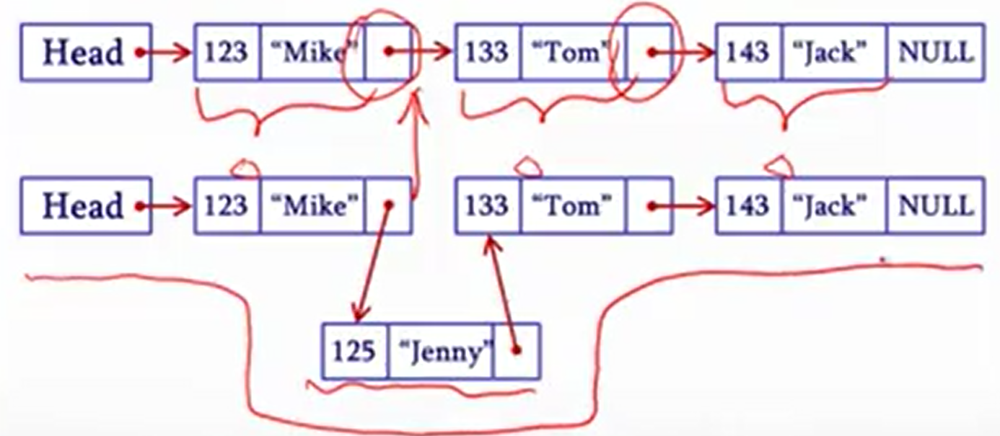

本筆記大部分内容來自北大信科李戈老師在Coursera上的課程《C程序設計進階》[^1]。

## 1. 鏈表的定義

當我們用數組保存數據時，數組元素被保存在一段連續的内存中，想將新數組插入數組中間十分困難。而**鏈表**用指針將各個元素“頭尾相接”，實現了一種更靈活的連接方式，很方便元素在中間插入。

鏈表是一種非常常用的數據結構，鏈表的構成：

- 鏈表頭：指向第一個鏈表節點的指針
- 鏈表節點：鏈表中的每一個元素，包括：
    - 當前節點的數據
    - 下一個節點的地址
- 鏈表尾：不再指向其他節點的節點，其地址部分放一個NULL，表示鏈表到此結束

## 2. 鏈表的創建

#### 動態地申請與釋放内存

用指令new和一個變量類型可申請一塊内存空間，後加小括號和值可初始化這片内存空間，new將返回一個指針。用指令delete可釋放指針變量所指的這塊内存空間。類似的，也能用new和delete為數組申請和釋放内存空間，但delete需要加方括號。

#### 動態地創建鏈表

由於new返回的是指針，用new和delete可很方便地逐個創建鏈表元素。

首先，可以用結構體構建出連邊元素的結構。用new爲其**分配内存空間**並**返回鏈表元素地址（指針）**。

創建第一個鏈表元素后，如果要接著創建下一個元素就用new申請下一元素的内存空間，否則將下一節點的地址設爲NULL。

#### 鏈表的歷邊

在創建鏈表的時候我們使用了一個臨時的指針變量temp，在每次創建完一個鏈表元素時，這個指針變量就指向下一個元素的地址。鏈表的歷邊過程也類似：創建一個臨時變量pointer，指向第一個元素的地址，訪問元素内容后直接用指令“pointer = pointer -> next;”將pointer指向下一個元素，直到下一個元素的地址為NULL。

#### 鏈表元素的刪除

創建一個臨時指針變量temp，找到要刪除的元素，**如果它是第一個元素**（元素地址等於鏈表的地址），就將鏈表地址移到第二個鏈表元素，并用delete釋放temp所在元素的内存；**如果它是最後一個元素**（元素的“下一個地址”為NULL），就創建一個新的指針變量follow指向temp所指元素的上一個元素，將上一個元素的“下一個地址”改爲NULL並用delete釋放temp所指元素占用的内存；**如果它是位於中間的元素**，就創建一個新的指針變量follow指向temp所指元素的上一個元素，將上一個元素的“下一個地址”改爲temp所指元素的“下一個地址”並用delete釋放temp所指元素占用的内存。

#### 為鏈表插入新元素

用new創建新元素后，先把新元素的“下一個地址”指向想要插入的位置，再將上一個元素或鏈表的地址改爲鋅元素的地址。一定要注意的是，先後順序不能錯，如果先改舊地址會導致原鏈表的“斷裂”，斷掉的那部分的地址就找不到了。

## 3. 雙向鏈表與循環鏈表

當鏈表元素中包含next和ahead兩個方向的指針變量時，這個鏈表就叫雙向鏈表。雖然這種鏈表用起來更靈活，但在鏈表中刪除和插入元素也更複雜。

在一些應用場景中，我們需要用到首尾相接的循環列表，可以把最後一個元素的“下一個地址”設爲鏈表的起始地址，也可以不動鏈表，用條件判斷實現，具體問題需要具體分析。

[^1]: https://www.coursera.org/learn/c-chengxu-sheji Coursera - C程序设计进阶