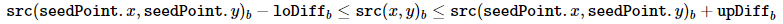

本文為林子祥老師的課程《3D視覺缺陷檢測：理論、源碼與實戰》的學習筆記[^1]。

## 1. 定義

Blob分析又稱斑點分析，是對圖像中相同像素的連通域進行分析，該連通域稱爲Blob[^2]。當圖像對比度較高時可用Blob分析提取特徵。

步驟：
1. 基於閾值分割出目标區域。按原理可分爲三種：基於亮度，基於RGB，基於自適應（動態閾值），要注意這一步只是將圖像轉爲一個或多個二值圖，并沒有將各個Blob區分開；
2. 細化區域，去除噪聲，可以基於形態學處理或根據特徵做區域篩選；
3. 對指定區域的blob進行分析，提取特徵，一般有數字特徵（如面積，凸殼相似度，區域輪廓長度，與圓的相似度）和非數字特徵（最小外接矩形/圓，對角綫長度，區域的骨架，區域輪廓）。

其中前兩步算是數據的預處理。而第三步是Blob分析的核心，又被稱爲Blob檢測（Blob detection）。視覺領域的Blob檢測主要思路是檢測出圖像中比周圍像素灰度大（或小）的區域[^4]，有兩種基本方法：
- 基於求導的微分方法，稱爲微分檢測器
- 基於局部極值的分水嶺算法，OpenCV中的simpleBlobDetector就是一種實現方法

## 2. 用途

用Blob分析有以下幾種用途[^3]：
- 提供有關區域的補充信息，比如用於獲取感興趣的區域進行進一步處理（Blob分析的輸出結果用於對象識別或對象跟蹤）
- 在其他域（如直方圖分析）中，Blob分析的輸出結果可用於峰值檢測，並應用於分割
- 用於紋理分析和紋理識別

## 3. OpenCV裏的相關函數

### 3.1 閾值處理函數 - threshold()

threshold()對一個多通道數組進行固定級別的閾值處理。該函數通常用於從灰度圖像中獲得二值圖，或用於去除噪聲（過濾掉過大或過小的像素）。該函數支持多種類型的閾值處理，可以用類型參數選擇用哪個[^5]。
```cpp
double cv::threshold	(	InputArray 	src,
    OutputArray 	dst,
    double 	thresh,
    double 	maxval,
    int 	type 
    )		
```
```python
cv.threshold(src, thresh, maxval, type[, dst]) -> retval, dst
```
- src：輸入數組（多通道，8或32位浮點數）
- dst：輸出數組，與輸入數組的尺寸、通道數、類型相同
- thresh：閾值
- maxval：為二值化閾值處理（THRESH_BINARY）和逆二值化閾值處理（THRESH_BINARY_INV）設定一個最大值
- type：閾值處理類型，詳見[文檔](https://docs.opencv.org/3.4/d7/d1b/group__imgproc__misc.html#gaa9e58d2860d4afa658ef70a9b1115576)或[這篇中文筆記](https://blog.csdn.net/keith_bb/article/details/54617625)，我們在Blob分析裏要用的是二值化閾值處理（THRESH_BINARY）和逆二值化閾值處理（THRESH_BINARY_INV）[^6][^7]
- 返回（C++）：如果用了Otsu's或Triangle型閾值處理，函數將返回計算出來的閾值

### 3.2 形態學處理 - morphologyEx()

morhologyEx()可實現以腐蝕和擴張為基礎操作的高級形態學變換[^8]。
```cpp
void cv::morphologyEx	(	InputArray 	src,
    OutputArray 	dst,
    int 	op,
    InputArray 	kernel,
    Point 	anchor = Point(-1,-1),
    int 	iterations = 1,
    int 	borderType = BORDER_CONSTANT,
    const Scalar & 	borderValue = morphologyDefaultBorderValue() 
    )	
```
```python
cv.morphologyEx(src, op, kernel[, dst[, anchor[, iterations[, borderType[, borderValue]]]]]	) -> dst
```
- src：原圖片。頻道數無所謂，深度應爲CV_8, CV_16U, CV_16S, CV_32F 或 CV_64F
- dst：輸出數組，與輸入數組的尺寸、通道數、類型相同
- op：形態學操作類型，詳見[文檔](https://docs.opencv.org/4.x/d4/d86/group__imgproc__filter.html#ga7be549266bad7b2e6a04db49827f9f32)，最常用的是腐蝕（MORPH_ERODE），擴張（MORPH_DILATE）和開值運算（MORPH_OPEN）[^9]
- kernel：構建核，可用getStructuringElement()生成[^10]
- anchor：構建核作用的錨點，若爲負值則錨點在構建核的中心
- iterations：腐蝕（MORPH_ERODE）和擴張（MORPH_DILATE）處理的重複次數
- borderType：填充方式，不支持BORDER_WRAP。詳解參考[這篇文檔翻譯](https://blog.csdn.net/qq_41498261/article/details/103705097)[^11]
- borderValue：若填充方式為常量填充BORDER_CONSTANT，用該參數確定要填充的值

### 3.3 漫水填充 - floodFill()

floodFill()從種子點開始用指定的顏色填充一個連通的組件。連通性是由相鄰像素的顏色/亮度的接近程度決定的[^12]。這篇太多了……所以我直接照搬了[別人的文檔翻譯](https://cloud.tencent.com/developer/article/1013350)，這位騰訊的大佬不僅翻譯了OpenCV的這部分文檔，還講了些漫水填充算法的基礎[^13]。
```cpp
int cv::floodFill	(	InputOutputArray 	image,
    InputOutputArray 	mask,
    Point 	seedPoint,
    Scalar 	newVal,
    Rect * 	rect = 0,
    Scalar 	loDiff = Scalar(),
    Scalar 	upDiff = Scalar(),
    int 	flags = 4 
    )	

int cv::floodFill	(	InputOutputArray 	image,
    Point 	seedPoint,
    Scalar 	newVal,
    Rect * 	rect = 0,
    Scalar 	loDiff = Scalar(),
    Scalar 	upDiff = Scalar(),
    int 	flags = 4 
    )	
```
```python
cv.floodFill(image, mask, seedPoint, newVal[, loDiff[, upDiff[, flags]]]) -> retval, image, mask, rect
```
- image：要處理的圖片，既是入參也是出參，接受單通道或3通道，8位或浮點類型的圖片。如果提供了Mask而且設置了 FLOODFILL_MASK_ONLY 的flag，輸入圖像才不會被修改，否則調用本方法填充的結果會修改到輸入圖像中。
- mask：掩碼圖像，既是入參也是出參，接受單通道8位的圖片，要求比要處理的圖片寬和高各大兩個像素。 mask要先初始化好，填充算法不能漫過mask中非0的區域。比如可以用邊緣檢測的結果來做為mask，以防止邊緣被填充。做為輸出參數，mask對應圖片中被填充的像素會被置為1或者下面參數指定的值。因此當多次調用floodFill方法，使用同一個mask時，可以避免填充區域疊加和重複計算。因為 mask比image大，所以image中的點 p(x,y)，對應mask中的點 p(x+1, y+1)
- seedPoint：填充算法的種子點，即起始點
- newVal：填充的顏色
- loDiff：最小的亮度或顏色的差值
- upDiff：最大的亮度者顏色的差值
- rect：可選的輸出參數，返回一個最小的矩形，可以剛好把填充的連通域包起來
- flags：
    - 低八位[0-7]表示連通性，默認值4表示四領域填充，8表示八領域填充
    - [8-15]位表示用來填充mask的顏色值[1-255]默認是1
    - 比如flag值(4|(255<<8))表示使用四鄰域填充，mask填充色值是255
    - 剩餘的位有兩個值可以單獨設置或者用“|”同時設置：
        - FLOODFILL_MASK_ONLY 表示不修改原始輸入圖像，只把結果輸出到mask圖中，在mask中將填充區域標上前面flag中指定的值。newVal的參數值將被忽略
        - FLOODFILL_FIXED_RANGE 表示待填充像素只和種子點比較。如果不設置這個標記，表示待填充像素是和相鄰的像素比較（相當於差值範圍是浮動的），這種情況下填充區域的像素可能會和種子點相差越來越大

未知點的判斷：

通過下面未知點是否應該填充的判斷條件，可以更好地理解上述參數的含義。

灰度圖固定範圍時（flag中設置了FLOODFILL_FIXED_RANGE），未知點的判斷只跟種子點比較：


灰度圖浮動範圍時，未知點的判斷跟相鄰的已經填充的點比較：


同理彩色圖固定範圍時的判斷：




彩色圖浮動範圍時的判斷：


### 3.4 查找輪廓 - findContours()

findContours()可從二值圖中找出每個輪廓（輸出的各個輪廓是彼此獨立的）。輸出的輪廓對形狀分析和對象檢測很有用[^16]。

順便一提，OpenCV的findContours()對我來説實在太重要了，經常用，但是一直都不懂它的原理，其他常用的輪子我也能自己造個能用的，就這個暫時還不行。所以有空還是得復習一下，論文是[這篇](https://www.sciencedirect.com/science/article/pii/0734189X85900167)[^14]，順便記錄一些論文的[中文詳解](https://blog.csdn.net/h649070/article/details/118991409)[^15]。
```cpp
void cv::findContours	(	InputOutputArray 	image,
    OutputArrayOfArrays 	contours,
    OutputArray 	hierarchy,
    int 	mode,
    int 	method,
    Point 	offset = Point() 
    )	

void cv::findContours	(	InputOutputArray 	image,
    OutputArrayOfArrays 	contours,
    int 	mode,
    int 	method,
    Point 	offset = Point() 
    )	
```
```python
cv.findContours(image, mode, method[, contours[, hierarchy[, offset]]]) -> image, contours, hierarchy
```
- image：8位單通道圖片。0還是0，非0像素點的值會被視爲1，也就是説輸入圖像一定會被看作二值圖。可以用compare, inRange, threshold, adaptiveThreshold, Canny等函數將原圖片轉爲二值圖作爲findContours()的輸入圖片。如果模式參數mode設爲RETR_CCOMP或RETR_FLOODFILL，那麽輸入圖片也可以是32位整型圖片（CV_32SC1）
- contours：檢測到的輪廓。每個輪廓都以向量的格式被包含在内，每個輪廓向量包含了該輪廓上的每個點的坐標（std::vector<std::vector\<cv::Point\>>）
- hierarchy：可選的輸出向量（std::vector\<cv::Vec4i\>），包含了圖像拓撲的信息。二值圖有幾個輪廓，它就有幾個元素，而且是跟contours裏的輪廓信息一一對應的，元素保存的是該輪廓的層級信息（每個輪廓的hierarchy包含4個整形數據來記錄層級關係）。具體地説，對於第i個輪廓（序號i以0為起始號），courtours[i]保存了輪廓上每個點的坐標，而hierachy[i]的信息如下：hierachy[i][0]是後一個輪廓的序號，hierachy[i][1]是前一個輪廓，hierachy[i][2]是子輪廓的序號，hierachy[i][3]是父輪廓的序號。如果值爲-1則表示沒有對應的關係[^17][^18]。
- mode：輪廓的檢索模式，有五種[^19]。
    - RETR_EXTERNAL：只保留最外層輪廓，hierachy裏的子輪廓和父輪廓當然就只有-1
    - RETR_LIST：檢索所有輪廓，但不搞任何層級關係
    - RETR_CCOMP：檢索所有輪廓，層級關係只有兩級，子輪廓如果還有孫子輪廓的話，孫子會被視作新的父輪廓
    - RETR_TREE：檢索所有輪廓，建立完整的層級關係
    - RETR_FLOODFILL：（文檔沒給解釋，我猜可能是把所有環形的拓撲結構填成實心的再檢測輪廓？但如果是這樣的話，跟RETR_EXTERNAL也沒區別啊？）
- method：四種輪廓點的表示方法，較常用的是CHAIN_APPROX_SIMPLE[^20][^21]
    - CHAIN_APPROX_NONE：保留所有邊界點
    - CHAIN_APPROX_SIMPLE：把平直的部分壓縮為端點（綫段中間不要了，只保留斷點）
    - CHAIN_APPROX_TC89_L1：Teh-Chin提出的一種算法的實現[^22]
    - CHAIN_APPROX_TC89_KCOS：Teh-Chin提出的一種算法的實現[^22]
- offset：為所有輪廓坐標所設的偏移量。若處理的是一個興趣區域（ROI），那麽坐標的偏移量在整張圖裏會很有用

### 3.5 簡單Blob檢測器 - SimpleBlobDetector

SimpleBlobDetector是個整合版的Blob分析工具[^23][^24]，也可以看作是個高階的findContours()。

1. 首先原圖像通過不同的閾值（由最大閾值、最小閾值和閾值步數決定）被轉爲多個二值圖；
2. 用findContours()從每個二值圖中找出連通元素以及它們的中心坐標；
3. 通過中心坐標將所有二值圖裏的連通元素合爲多個小組，合并力度（集中還是分散）是通過參數minDistBetweenBlobs控制的；
4. 為各個小組（Blob）記錄中心點和半徑，并返回關鍵點的位置和尺寸。

## 4. 實踐

輸出：


代碼：
```cpp
#include <iostream>
using namespace std;

#include <opencv2/opencv.hpp>

/*
===============================================================================
||   Authors   | 劉啟迪(Qidi Liu)
||-------------|---------------------------------------------------------------
||   License   | Only for Private use
||-------------|---------------------------------------------------------------
|| Description | 使用基於大津法的簡單Blob分析提取元器件區域
===============================================================================
*/

#define MORPHOLOGY_OPEN_KERNEL_KSIZE 3
#define GRID_CELL_NUM_Y 44 
#define GRID_CELL_NUM_X 66

cv::Mat IMAGE = cv::imread("depthMap/depthMap8.tiff", cv::IMREAD_UNCHANGED);

void showImage(cv::String windows_title, cv::Mat image)
{
    cv::Mat _showing_image;
    image.convertTo(_showing_image, CV_32FC1);
    cv::imshow(windows_title, _showing_image);
}

int main(int argc, char*argv[])
{
    if (!IMAGE.data)
    {
        printf("Input image is empty! Please check! \n");
        return -1;
    }
    else
    {
        cv::Mat _showing_original_image;
        IMAGE.convertTo(_showing_original_image, CV_8UC3);
        cv::imshow("Original depthmap", _showing_original_image);
        IMAGE.convertTo(IMAGE, CV_16UC1);
    }

    cv::Mat _binary_image;
    cv::threshold(IMAGE, _binary_image, 0 /*ignored value*/, 1, cv::THRESH_OTSU);
    //showImage("Binary image after Otsu's threshold process", _binary_image);

    cv::Mat _morphology_opened_image;
    cv::Mat _morphology_open_kernel = cv::getStructuringElement(
        cv::MORPH_RECT,
        cv::Size(MORPHOLOGY_OPEN_KERNEL_KSIZE, MORPHOLOGY_OPEN_KERNEL_KSIZE)
    );
    cv::morphologyEx(
        _binary_image,
        _morphology_opened_image,
        cv::MORPH_OPEN,
        _morphology_open_kernel
    );
    //showImage("Binary image after morphology process (open)", _morphology_opened_image);
    
    _morphology_opened_image.convertTo(_morphology_opened_image, CV_8UC1);
    cv::Mat _filled_image = cv::Mat::zeros(
        _morphology_opened_image.rows + 2,
        _morphology_opened_image.cols + 2,
        CV_8UC1
    );

    /*
    // 大水漫灌用法示範，在二值圖上用顯然沒有意義，所以去掉了，
    // 值得注意的是種子點需要手動選擇，另外，大水漫灌的輸出圖比輸入圖胖一圈（長寬各加兩個像素），
    // 所以等灌完看情況可能還得剪掉外面那一圈
    int seedpoint_y = 22 * (_morphology_opened_image.rows / GRID_CELL_NUM_Y) + 1;
    int seedpoint_x = 22 * (_morphology_opened_image.cols / GRID_CELL_NUM_X) + 1;
    cv::floodFill(
        _morphology_opened_image,
        _filled_image,
        cv::Point(seedpoint_x, seedpoint_y),
        cv::Scalar(1)
    );
    */

    /* 
    // 這一塊是個錯誤示範，當時我對漫水填充的認識不足，以爲它類似於腐蝕算法，
    // 於是打算用條件判斷確保二值圖内所有亮度為1的地方被“大水漫灌一邊”，
    // 教科書般的大聰明操作哈哈哈哈哈哈哈哈哈哈
    for (int i = 0; i < GRID_CELL_NUM_Y; i++)
    {
        for (int j = 0; j < GRID_CELL_NUM_X; j++)
        {
            int seedpoint_y = (i + 0.5) * (_morphology_opened_image.rows / GRID_CELL_NUM_Y) + 1;
            int seedpoint_x = (j + 0.5) * (_morphology_opened_image.cols / GRID_CELL_NUM_X) + 1;
            double seedpoint_value = _morphology_opened_image.at<uchar>(seedpoint_y, seedpoint_x);
            if (seedpoint_value == 1)
            {
                //Debug
                cout << "Debug: " << endl;
                cout << i << " " << seedpoint_y << endl;
                cout << j << " " << seedpoint_x << endl;

                cv::Mat mask = cv::Mat::zeros(
                    _morphology_opened_image.rows + 2,
                    _morphology_opened_image.cols + 2,
                    CV_8UC1
                );
                cv::floodFill(
                    _morphology_opened_image,
                    mask,
                    cv::Point(seedpoint_x, seedpoint_y),
                    cv::Scalar(1)
                );
                _filled_image += mask;
            }
        }
    }

    cv::threshold(_filled_image, _filled_image, 0.5, 1, cv::THRESH_BINARY);    
    _filled_image = _filled_image(cv::Rect(1, 1, _morphology_opened_image.cols, _morphology_opened_image.rows));
    //showImage("Binary image after flood fill", _filled_image);
    */

    vector<vector<cv::Point>> _contours;
    //cv::findContours(_filled_image, _contours, cv::RETR_LIST, cv::CHAIN_APPROX_NONE);
    cv::findContours(morphology_opened_image, _contours, cv::RETR_LIST, cv::CHAIN_APPROX_NONE);
    int _contours_num = _contours.size();
    cout << "Debug: there are " << _contours_num << " contours detected." << endl;
    cv::Mat _with_contours_image;
    IMAGE.convertTo(_with_contours_image, CV_8UC3);
    cv::cvtColor(_with_contours_image, _with_contours_image, cv::COLOR_GRAY2BGR);
    
    for (int i = 0; i < _contours_num; i++)
        cv::drawContours(_with_contours_image, _contours, i, cv::Scalar(0, 0, 255), 2);

    cv::imshow("Image with contours", _with_contours_image);
    cv::waitKey(0);
    
    return 0;
}
```

[^1]: https://www.3dcver.com/detail/p_623728ece4b09dda124fe569/6 3D與SLAM - 3D視覺缺陷檢測：理論、源碼與實戰
[^2]: https://blog.csdn.net/tercel_zhang/article/details/51227431 CSDN - Blob分析
[^3]: https://en.wikipedia.org/wiki/Blob_detection Wikipedia - Blob detection
[^4]: https://blog.csdn.net/weixin_37684437/article/details/108075887 CSDN - Blob detection+高斯二阶导(拉普拉斯模板)+尺度的选择+加快速度(DoG+分层处理)
[^5]: https://docs.opencv.org/3.4/d7/d1b/group__imgproc__misc.html#gae8a4a146d1ca78c626a53577199e9c57 OpenCV - threshold()
[^6]: https://docs.opencv.org/3.4/d7/d1b/group__imgproc__misc.html#gaa9e58d2860d4afa658ef70a9b1115576 OpenCV - threshold types
[^7]: https://blog.csdn.net/keith_bb/article/details/54617625 CSDN - opencv学习(二十八)之基本图像阈值操作threshold
[^8]: https://docs.opencv.org/4.x/d4/d86/group__imgproc__filter.html#ga67493776e3ad1a3df63883829375201f OpenCV - morphologyEx()
[^9]: https://docs.opencv.org/4.x/d4/d86/group__imgproc__filter.html#ga7be549266bad7b2e6a04db49827f9f32 OpenCV - MorphTypes
[^10]: https://docs.opencv.org/4.x/d4/d86/group__imgproc__filter.html#gac342a1bb6eabf6f55c803b09268e36dc OpenCV - getStructuringElement()
[^11]: https://blog.csdn.net/qq_41498261/article/details/103705097 OpenCV库成员——BorderTypes
[^12]: https://docs.opencv.org/4.x/d7/d1b/group__imgproc__misc.html#ga366aae45a6c1289b341d140839f18717 OpenCV - floodFill()
[^13]: https://cloud.tencent.com/developer/article/1013350 腾讯云 - 图像处理之漫水填充算法（flood fill algorithm）
[^14]: https://www.sciencedirect.com/science/article/pii/0734189X85900167 Satoshi Suzuki and others. Topological structural analysis of digitized binary images by border following. Computer Vision, Graphics, and Image Processing, 30(1):32–46, 1985.
[^15]: https://blog.csdn.net/h649070/article/details/118991409 CSDN - OpenCV之findcontours原理参考、理解和用法
[^16]: https://docs.opencv.org/3.4/d3/dc0/group__imgproc__shape.html#ga17ed9f5d79ae97bd4c7cf18403e1689a OpenCV - findContours()
[^17]: https://docs.opencv.org/3.4/d9/d8b/tutorial_py_contours_hierarchy.html OpenCV - Contours Hierarchy
[^18]: https://blog.csdn.net/qq_33810188/article/details/81285867 CSDN - OpenCV中findcontours函数hierarchy轮廓层级详解
[^19]: https://docs.opencv.org/3.4/d3/dc0/group__imgproc__shape.html#ga819779b9857cc2f8601e6526a3a5bc71 OpenCV - RetrievalModes
[^20]: https://docs.opencv.org/3.4/d3/dc0/group__imgproc__shape.html#ga4303f45752694956374734a03c54d5ff OpenCV - ContourApproximationModes
[^21]: https://blog.csdn.net/chaipp0607/article/details/61431922 CSDN - OpenCV findContours函数边缘近似方法
[^22]: https://ieeexplore.ieee.org/abstract/document/31447/?casa_token=ic9Fe3qjWsUAAAAA:xwFyOdknmfFvHOzgTis9C_ZxTu30S95rk-Z0E_-yYu1kca8L3XtjzjcqRJaxjk3rBpw3qqgZOA4 C-H Teh and Roland T. Chin. On the detection of dominant points on digital curves. Pattern Analysis and Machine Intelligence, IEEE Transactions on, 11(8):859–872, 1989.
[^23]: https://docs.opencv.org/3.4/d0/d7a/classcv_1_1SimpleBlobDetector.html OpenCV - SimpleBlobDetector
[^24]: https://blog.csdn.net/zhaocj/article/details/44886475 CSDN - Opencv2.4.9源码分析——SimpleBlobDetector