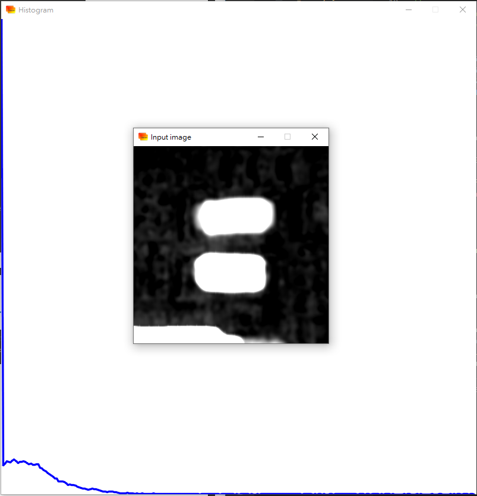

本文為林子祥老師的課程《3D視覺缺陷檢測：理論、源碼與實戰》的學習筆記[^1]。

## 1. 直方圖定義

圖像的直方圖通常指像素强度值的直方圖，用於顯示强度值中像素的分佈。直方圖的橫坐標為强度，縱坐標為像素數。比如對於8位灰度圖來説，橫坐標就是256種灰度。

## 2. 直方圖處理種類

#### 直方圖均衡

用於圖像增强，通過均衡（藉助直方圖變換實現灰度映射）使直方圖往中間集中，能增强圖像細節。

#### 局部直方圖均衡化

用滑動窗口實現直方圖均衡，適應能力更强。可以重叠也可以不重叠，但容易出現“棋盤格效應”。

#### 直方圖匹配（規定化）

將直方圖變換到指定變化趨勢的直方圖，用於直方圖修正。

#### 直方圖統計

本節重點。針對對比度差的局部區域進行提升，以實現局部區域的圖像增强。

## 3. 直方圖統計詳解

一個前景與後景對比明顯的圖像，它的直方圖應該有兩個明顯分開的波峰。一個波峰對應前景，另一個對應後景。波峰之間的波谷對應目標邊緣區域，找到邊緣區域就可以作爲閾值，以方便地做穩健的閾值分割。

優化方案：
- 對直方圖進行高斯平滑處理，反復調標準差，直到直方圖只剩兩個波峰。缺點就是需要手動調節標準差
- 大津法（Otsu算法）可以全自動計算圖像分割閾值

#### 大津法

大津法假定圖像只包含兩類像素（前景像素與後景像素），計算出的最佳閾值使類内方差最小（大進證明了最小化類内方差和最大化類間方差是等效的，所以實際計算時其實是使類間方差最大）。而大津法的多級閾值擴充稱爲多大津法[^4][^6]。

1. 計算每種像素强度的像素數和像素數的比重（計算直方圖）
2. 窮舉計算兩個類的比重$\omega(t)$和均值$\mu(t)$，以計算類間方差（$t$指像素强度，$\sigma_b^2(t)$指以當前像素强度$t$為閾值時的類間方差）
    $$\sigma_b^2(t)=\omega_1(t)\omega_2(t)[\mu_1(t)-\mu_2(t)]^2$$
3. 找出類間方差時對應的像素强度，即最優圖像分割閾值

大津法可通過OpenCV的threshold()函數實現，需要設定參數CV_THRESH_OTSU來實現調用[^2][^3]。
```cpp
double threshold = cv::threshold(src, dst, 0, 255, CV_THRESH_BINARY|CV_THRESH_OTSU);
```

查資料的時候看到CSDN某大佬實現了[比OpenCV快的大津法](https://blog.csdn.net/u012198575/article/details/81128799)，值得參考[^5]。

#### OpenCV的直方圖統計函數calcHist()

calcHist()可計算一個或多個數組的直方圖[^7]。

```cpp
void cv::calcHist	(	const Mat * 	images,
    int 	nimages,
    const int * 	channels,
    InputArray 	mask,
    OutputArray 	hist,
    int 	dims,
    const int * 	histSize,
    const float ** 	ranges,
    bool 	uniform = true,
    bool 	accumulate = false 
    )	

void cv::calcHist	(	const Mat * 	images,
    int 	nimages,
    const int * 	channels,
    InputArray 	mask,
    SparseMat & 	hist,
    int 	dims,
    const int * 	histSize,
    const float ** 	ranges,
    bool 	uniform = true,
    bool 	accumulate = false 
    )	

void cv::calcHist	(	InputArrayOfArrays 	images,
    const std::vector< int > & 	channels,
    InputArray 	mask,
    OutputArray 	hist,
    const std::vector< int > & 	histSize,
    const std::vector< float > & 	ranges,
    bool 	accumulate = false 
    )	
```
```python
cv.calcHist(images, channels, mask, histSize, ranges[, hist[, accumulate]]) -> hist
```
- images：原圖像數組。所有原圖像應該具有相同的深度（CV_8U, CV_16U 或 CV_32F）和相同尺寸，每張圖的通道數是任意的
- nimages：原圖像的數量
- channels：指定各個圖像用哪個或哪幾個通道，注意是以纍加法來指定的，比如第一個圖像的指定通道是0到images[0].channels() - 1，第二個是從images[0].channels()到images[0].channels() + images[1].channels() - 1，依此類推
- mask：可選的掩膜，如果此項不爲空的話，必須是一個8位、與原圖像尺寸一致的數組。掩膜中非零位置的像素會被計入直方圖
- hist：輸出直方圖
- dims：輸出直方圖的維度，正數，不能高於32（一般設爲1，我不太清楚大於1能幹啥，如果有知道的麻煩告訴我，謝謝！）
- histSize：包含每個維度的直方圖尺寸的數組（把直方圖看成一個一個竪條的話，就是每一維上竪條的個數[^8]）
- ranges：在每一維上設一個統計範圍，由這些統計範圍組成的數組
- uniform：是否要做歸一化處理（歸一化也會影響統計範圍設定）
- accumulate：是否纍加多張圖片的直方圖，如果設爲false，換圖片就會清空，重新算（可能對標准的可控的場景有用）

## 4. 實踐

輸出：



代碼：
```cpp
#include <iostream>
using namespace std;

#include <opencv2/opencv.hpp>

/*
===============================================================================
||   Authors   | 劉啟迪(Qidi Liu)
||-------------|---------------------------------------------------------------
||   License   | Only for Private use
||-------------|---------------------------------------------------------------
|| Description | 計算圖像直方圖
===============================================================================
*/

#define HISTOGRAM_WIDTH 800
#define HISTOGRAM_HEIGHT 800
#define HIST_SIZE 256
#define UNIT_WIDTH HISTOGRAM_WIDTH/HIST_SIZE

cv::Mat IMAGE = cv::imread("depthMap/depthMap5.tiff", cv::IMREAD_UNCHANGED);

int main(int argc, char*argv[])
{
    if (!IMAGE.data)
    {
        printf("Input image is empty! Please check! \n");
        return -1;
    }
    else
    {
        IMAGE.convertTo(IMAGE, CV_8UC1);
        cv::imshow("Input image", IMAGE);
    }

    const cv::Mat _input_image = IMAGE;
    cv::Mat _histogram;
    const int _channels = 0;
    const int _hist_size = HIST_SIZE;
    float _range[] = {0, 255};
    const float * _ranges[] = {_range};
    cv::calcHist(
        &_input_image,
        1,
        &_channels,
        cv::Mat(),
        _histogram,
        1,
        &_hist_size,
        &_ranges[0]
    );

    cv::normalize(_histogram, _histogram, 0, HISTOGRAM_HEIGHT, cv::NORM_MINMAX, -1, cv::Mat());
    cv::Mat _histograms_plot(HISTOGRAM_WIDTH, HISTOGRAM_HEIGHT, CV_8UC3, cv::Scalar(255, 255, 255));

    for (int i = 0; i < HIST_SIZE; i++)
    {
        cv::line(
            _histograms_plot,
            cv::Point((i - 1) * UNIT_WIDTH, HISTOGRAM_HEIGHT - cvRound(_histogram.at<float>(i - 1))),
            cv::Point((i) * UNIT_WIDTH, HISTOGRAM_HEIGHT - cvRound(_histogram.at<float>(i))),
            cv::Scalar(255, 0, 0),
            2,
            cv::LINE_AA
        );
    }
    
    cv::imshow("Histogram", _histograms_plot);

    cv::waitKey(0);

    return 0;
}
```

[^1]: https://www.3dcver.com/detail/p_623728ece4b09dda124fe569/6 3D與SLAM - 3D視覺缺陷檢測：理論、源碼與實戰
[^2]: https://docs.opencv.org/3.4/d7/d1b/group__imgproc__misc.html#gae8a4a146d1ca78c626a53577199e9c57 OpenCV - threshold()
[^3]: https://zhuanlan.zhihu.com/p/509261798 知乎 - 【缺陷檢測】2.2 Blob分析
[^4]: https://zh.wikipedia.org/wiki/%E5%A4%A7%E6%B4%A5%E7%AE%97%E6%B3%95 Wikipedia - 大津演算法
[^5]: https://blog.csdn.net/u012198575/article/details/81128799 CSDN - 详细及易读懂的 大津法（OTSU）原理 和 比opencv自带更快的算法实现
[^6]: https://cw.fel.cvut.cz/b201/_media/courses/a6m33bio/otsu.pdf OTSU, Nobuyuki. A threshold selection method from gray-level histograms. IEEE transactions on systems, man, and cybernetics, 1979, 9. Jg., Nr. 1, S. 62-66.
[^7]: https://docs.opencv.org/4.x/d6/dc7/group__imgproc__hist.html#ga4b2b5fd75503ff9e6844cc4dcdaed35d OpenCV - calcHist()
[^8]: https://www.cnblogs.com/wyuzl/p/6702785.html#:~:text=OpenCV%20%E6%8F%90%E4%BE%9B%E4%BA%86calcHist%E5%87%BD%E6%95%B0%E6%9D%A5%E8%AE%A1%E7%AE%97%E5%9B%BE%E5%83%8F%E7%9B%B4%E6%96%B9%E5%9B%BE%E3%80%82%20%E5%85%B6%E4%B8%ADC%2B%2B%E7%9A%84%E5%87%BD%E6%95%B0%E5%8E%9F%E5%9E%8B%E5%A6%82%E4%B8%8B%EF%BC%9Avoid%20calcHist%20%28const%20Mat%2A%20arrays%2C%20int,histSize%2C%20const%20float%2A%2A%20ranges%2C%20bool%20uniform%3Dtrue%2C%20bool%20accumulate%3D 博客園 - opencv2 直方图之calchist函数使用（转）