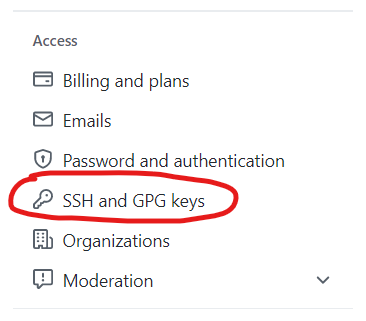

説實話，[Github給的教程](https://docs.github.com/en/authentication/connecting-to-github-with-ssh)已經夠詳細的了[^1]。今天搞這個文章主要是因爲：就算我已經裝過好幾次了，昨天重裝系統配置這一塊的時候又出現了問題，而且連著遇到兩個問題。雖然浪費時間，但還是決定專門總結一下。

!!!注意，本配置過程適用於**Windows**系統，部分指令不能在Linux和MacOS用。

## 1. Git安裝與設置

1. 在[Git官網](https://git-scm.com/downloads)下載安裝程序[^2]，並按默認選項安裝（就算你不想用默認選項，也請保留**Git Bash**和**SSH**，因爲後面要用）。
2. 打開Git Bash，設定用戶名和郵箱，這裏一定要注意，**用戶名和郵箱一定要與GitHub用戶名、郵箱一樣**，多個空格都會導致ssh key不能用（猜猜誰昨天栽在這裏了┭┮﹏┭┮）。
    ```bash
    git config --global user.name "QidiLiu"
    git config --global user.email your_email@example.com
    ```

## 2. SSH生成與設定

1. 還是在Git Bash裏，通過以下指令生成一個SSH密鑰，還是那句話，一定要與GitHub一致。
    ```bash
    ssh-keygen -t ed25519 -C "your_email@example.com"
    ```
2. 生成密鑰的過程中，程序會先問你存在哪，可以直接回車按默認目錄保存。
3. 還會問你要設什麽密碼（以及重複密碼），這裏直接回車確認就是無密碼。
4. 通過以下指令開啓ssh-agent。如果返回了一個Agent pid ****（數字），説明開啓成功了。
    ```bash
    eval `ssh-agent -s`
    ```
5. 通過以下指令將SSH密鑰加入剛剛開啓的ssh-agent（前提是你用的默認目錄保存SSH密鑰）。
    ```bash
    ssh-add ~/.ssh/id_ed25519
    ```
6. 將SSH密鑰的公開碼複製到粘貼版上，這一步可以打開.ssh文件夾下的id_ed25519.pub，然後全選複製，也可以接著上面的步驟用以下指令直接複製。
    ```bash
    clip < ~/.ssh/id_ed25519.pub
    ```
## 3. 將SSH密鑰加入Github中

1. 登錄Github，從右上角頭像菜單中進入設置（settings）。
    
2. 從左側分欄選擇SSH and GPG keys。
    
3. 按綠色按鈕“New SSH key”，填個名字，然後把之前複製的.pub文件中的内容粘貼到第二個空裏，確定。
4. 檢查一下是否設置成功：在Git Bash中輸入以下指令，如果返回Hi ***! You've successfully blablabla...就説明設定成功了。如果沒有，就繼續往下看。
5. 如果你跟我一樣倒霉，正好在用一個加了限制的網絡，上一步測試可能會發返回ssh: connect to host github.com port 22: Connection timed out。如何解決呢？簡單地說可以給github換個端口[^3]，具體的，在.ssh文件夾裏創建一個新文件，名爲config，如果你用vim，可以在Git Bash裏用以下指令，如果不會用也可以用vscode（把以下指令中的vim換爲code）
    ```bash
    vim ~/.ssh/config
    ```
6. config裏寫如下内容，保存後再試試第4步的測試指令應該就成功了。
    ```bash
    Host github.com
    User git
    Hostname ssh.github.com
    PreferredAuthentications publickey
    IdentityFile ~/.ssh/id_ed25519
    Port 443
    ```

[^1]: https://docs.github.com/en/authentication/connecting-to-github-with-ssh GitHub Docs - Connecting to GitHub with SSH
[^2]: https://git-scm.com/downloads Git官網下載地址
[^3]: https://stackoverflow.com/questions/15589682/ssh-connect-to-host-github-com-port-22-connection-timed-out stackoverflow - ssh: connect to host github.com port 22: Connection timed out
