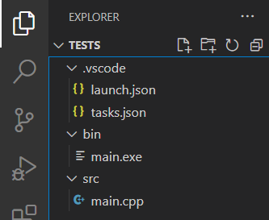

本文大多數步驟參考自知乎的一篇配置教程：[知乎 - 挑把趁手的兵器——VSCode配置C/C++学习环境（小白向）](https://zhuanlan.zhihu.com/p/147366852)[^1]。本配置方案適用於**Windows**系統，**VSCode**作爲編輯器打底，**MingGW-w64**裏的**g++**作爲編譯器，一些**VSCode插件**作爲編程輔助。

## 1. 安裝程序和插件

1. 從[VSCode官網](https://code.visualstudio.com/)安裝VSCode[^2]，勾選上加入環境變量的選項。
2. 在VSCode中安裝**插件C/C++**。
3. 下載MinGW-w64：[下載地址](https://sourceforge.net/projects/mingw-w64/files/)，點進去后往下拉，選擇**MinGW-W64 GCC-8.1.0下的x86_64-win32-seh**[^3]。
4. 解壓后將文件夾**mingw64**移動到目錄C:\Program File\下。
5. 將mingw64下的\bin文件夾的完整地址添加到用戶的環境變量Path中。（win10下，進入Path后有個瀏覽按鈕，可以很輕鬆地找到mingw64下的bin目錄並加入Path，不用複製，很方便）
6. 重新啓動電腦。

## 2. 构建项目结构

這一步建議按自己習慣來，按我的習慣，最起碼要在項目文件夾下建3個文件夾：
- .vscode: 存放與VSCode相關的配置文件，如Debug設定
- src: 存放源代碼
- bin: 存放由源代碼編譯出來的可執行程序



在一些稍微大一點的項目裏還會有build文件夾，一般用於存放編譯設定文件

## 3. VSCode調試設定

剛才下載的MingGW-w64裏的g++.exe用於編譯C++程序，gdb.exe用於調試，有了這兩個文件就已經可以做最最基本的C++開發了，但爲了更方便的調試，我們可以把編譯、調試及運行的動作集成到VSCode中，用VSCode内建的快捷鍵和交互界面讓開發更輕鬆。實現的方法就是在剛才創建的.vscode文件夾下創建兩個配置文件：**tasks.json**和**launch.json**。（所有//后的内容都是注釋，刪掉也可以）

!!!注意，以下配置内容適合C++程序的編譯和調試，如果想找適用於C程序的調試設定建議參考[這篇文章](https://zhuanlan.zhihu.com/p/147366852)。[^1]

tasks.json的内容如下：
```json
{
    "version": "2.0.0",
    "tasks": [
        {
            "label": "build", // 任務名稱，表示本大括號内任務為構建任務
            "type": "shell", // 任務類型，process是VSCode把預定義變量和轉義解析后直接全部傳給command; 而shell相當於先打開shell再輸入命令，所以args還會經過shell再解析一遍
            "command": "g++", // 編譯命令，編譯c的話換成gcc
            "args": [ // 傳給g++.exe的參數
                "${file}", // 指定要編譯的文件
                "-o", // 指定後面跟的輸出文件
                "${fileDirname}\\..\\bin\\${fileBasenameNoExtension}.exe", // 編譯輸出文件
                "-g", // 指定後面跟的調試設置
                "-Wall", // 開啓額外警告
                "-static-libgcc", // 靜態鏈接libgcc
                "-static-libstdc++", // 靜態鏈接libstdc++
                "-fexec-charset=UTF-8", // 生成的程序使用UTF-8編碼，也可以用GBK
                "-std=c++11", // 語言標準，如果要編譯C代碼可換成c11，當然，也可以用別的標準
            ],
            "group": {
                "kind": "build", // 表示本任務屬於build組
                "isDefault": true // 表示本任務是build組的默認任務
            },
            "presentation": { // 跟終端輸出相關的一些設定
                "echo": true, // 表示在執行任務時在終端要有輸出
                "reveal": "always", // 執行任務時是否跳轉至終端面板，可以是always, silent, never
                "focus": false, // 設爲true后可以使執行task時聚焦在終端，但對編譯來説，設爲true沒有意義，因爲運行的時候才涉及到輸入
                "panel": "shared", // 每次執行task的時候用同一個終端面板，如果設置爲new就是每次都新建一個終端面板
                "showReuseMessage": false, // 關閉“任務將被終端重用”的提示
                "clear": false // 不清理終端
            },
            "problemMatcher": "$gcc" // 捕捉編譯時編譯器在終端裏現實的報錯信息，將其顯示在VSCode的問題面板裏
        },
        {
            "label": "run", // 任務名稱，表示本大括號内任務用於運行可執行程序
            "type": "shell", // 任務類型，process是VSCode把預定義變量和轉義解析后直接全部傳給command; 而shell相當於先打開shell再輸入命令，所以args還會經過shell再解析一遍
            "dependsOn": "build", // 任務依賴，因爲運行前必須先編譯構建，所以執行本任務前必須先運行build任務
            "command": "${fileDirname}\\..\\bin\\${fileBasenameNoExtension}.exe", // 執行exe文件，只需要指定exe文件在那就好
            "group": {
                "kind": "test", // 本任務屬於test組，將run任務放在test組裏方便我們用快捷鍵執行
                "isDefault": true // 表示本任務是test組的默認
            },
            "presentation": {
                "echo": true, // 執任務時在終端有輸出
                "reveal": "always", // 執行任務時跳轉至終端面板，可以是always, silent, never
                "focus": true, // 執行任務時聚焦在終端，運行exe程序時聚焦在終端可以方便我們進行輸入
                "panel": "shared", // 不新建終端面板，若要新建則換爲new
                "showReuseMessage": false, // 關閉“任務將被終端重用”的提示
                "clear": false // 不清理終端
            }
        }
    ]
}
```

launch.json的内容如下：
```json
{
    "version": "0.2.0",
    "configurations": [
        {
            "name": "Debug", // 表示本大括號内為調試（Debug）的配置
            "type": "cppdbg", // 配置類型，cppdbg對應cpptools提供的調試功能
            "request": "launch",
            "program": "${fileDirname}\\..\\bin\\${fileBasenameNoExtension}.exe",
            "args": [],
            "stopAtEntry": false,
            "cwd": "${fileDirname}",
            "environment": [],
            "externalConsole": false,
            "internalConsoleOptions": "neverOpen",
            "MIMode": "gdb",
            "miDebuggerPath": "C:\\Program Files\\mingw64\\bin\\gdb.exe",
            "preLaunchTask": "build"
        }
    ]
}
```

這樣就配置完成了，在源代碼的頁面按F5即可調試。

其實爲了方便可以把.vscode文件夾裏的設定文件當作模板保存下來，每次創建項目的時候搬過來直接用。或者更進一步，用python寫個脚本自動創建各個文件夾以及VSCode設定文件。

還有個值得注意的點是：“編譯+運行”與調試是兩種不同的操作，前者在VSCode裏沒有默認的快捷鍵設置。可以在VSCode裏Ctrl+Shift+P找到Open Keyboard Shortcuts進行設置。叫“Tasks: Run Test Task”，中文是“任務：運行測試任務”。

[^1]: https://zhuanlan.zhihu.com/p/147366852 知乎 - 挑把趁手的兵器——VSCode配置C/C++学习环境（小白向）
[^2]: https://code.visualstudio.com/ VSCode官網
[^3]: https://sourceforge.net/projects/mingw-w64/files/ SOURCEFORGE - MinGW-W64