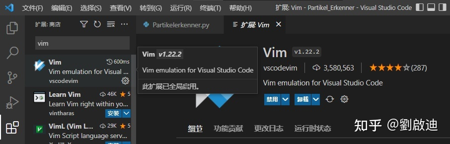
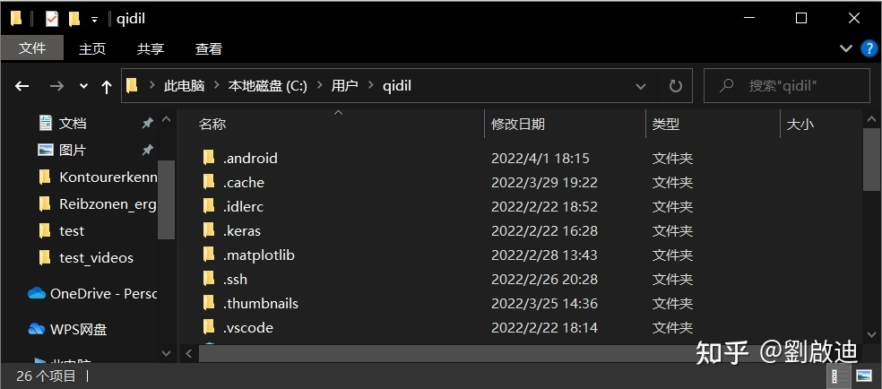
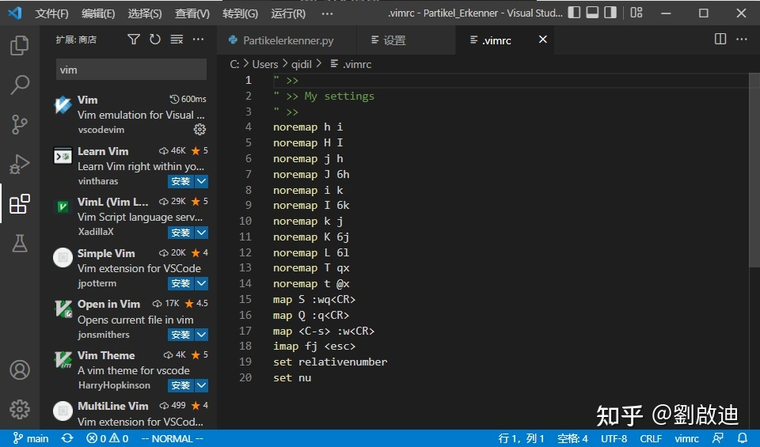
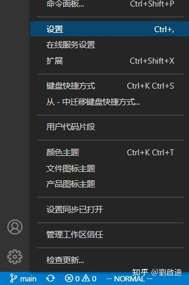
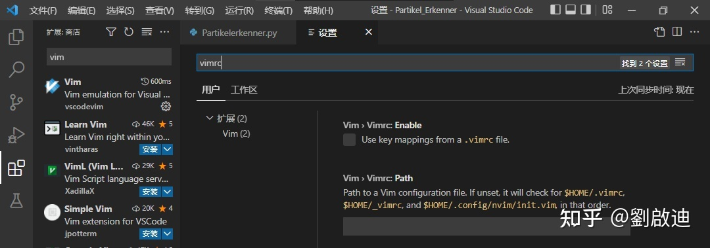
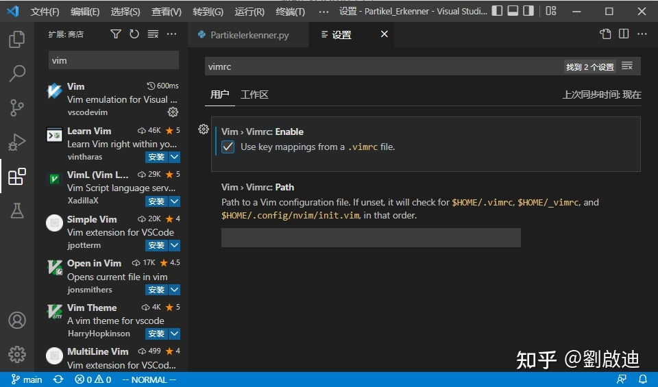
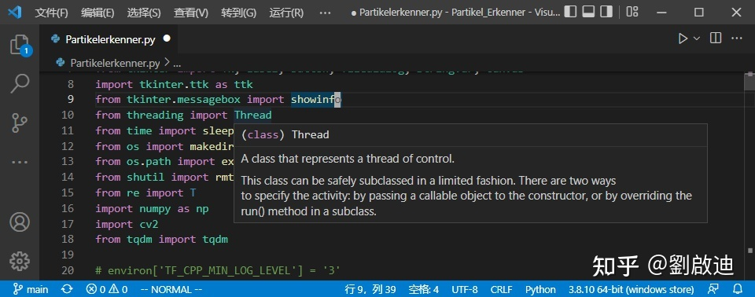

VS Code 和 Vim 混搭著用既可以享受 VS Code 開箱即用的各種插件，也可以享受純鍵盤操作的便捷。較早的配置教程一般都用 VS Code 的 json 配置文件，顯然不如 vim 原生的 vimrc 用起來舒服。本文記錄了筆者用vimrc配置 VS Code 的 Vim 插件的過程。

設置方法來自stackoverflow的一片問答[^1]。

!!! 注意：雖然能用 vimrc，但說到底這個插件是在模擬 Vim，並沒有真正的 Vim 在底層作為支撐，所以無法支持插件，我只用配了我比較習慣的鍵位映射。

## 1. 在 VS Code 中安裝 Vim 插件

沒啥好說的，搜插件 Vim 然後安裝就完了。



## 2. 寫個 vimrc 文件並保存至 $Home 目錄
所謂 $Home 目錄在 Windows 系統裡就是 C盤 => 用戶(Users) => 你用戶名的文件夾。

比如在我這裡用戶名是qidil，我的 $Home 目錄就如圖所示



如果你用 Linux 系統或 MacOS 系統，應該也差不多，直接找 /home/<用戶名> 目錄就好。

在 $Home 目錄下新建文件 ".vimrc"（別落下文件名里那個點），然後按你自己的需要修改，然後保存。



## 3. 設置 Vim 插件

點擊左下方小齒輪，點擊設置/Settings。



在最上方的搜索欄搜索 vimrc。



勾選 "Use key mappings from a .vimrc file"。



然後就能用了。注意，作者在設置裏也寫了，是鍵盤映射。試驗了一下，儘管我在 .vimrc 裡寫了 set relativenumber，但實際使用中並沒有這個效果。



一點題外話：相對行數功能對Vim用戶還是很重要的。VS Code 中，只要在設置中搜索“Line Numbers”，設置爲relative就好了[^2]。

還有一種vim鍵盤映射是用VSCode自帶的Keyboard shortcuts(JSON)實現，在VSCode裏按Ctrl+Shift+P搜索Keyboard shortcuts（JSON）打開後插入下面的内容可以使Normal模式下的z鍵實現原來F5的那套調試功能。沒錯我們Vim用戶就是這麽矯情，F5太遠了我懶得去按！ㄟ(≧◇≦)ㄏ。注意要加到中括號裏，中括號不要刪除。

```json
{
    "key": "z",
    "command": "debug.openView",
    "when": "!debuggersAvailable && inputFocus && vim.mode == 'Normal'"
},
{
    "key": "z",
    "command": "workbench.action.debug.continue",
    "when": "debugState == 'stopped' && inputFocus && vim.mode == 'Normal'"
},
{
    "key": "z",
    "command": "workbench.action.debug.start",
    "when": "debuggersAvailable && debugState == 'inactive' && inputFocus && vim.mode == 'Normal'"
}
```

[^1]: https://stackoverflow.com/questions/63017771/how-to-modify-change-the-vimrc-file-in-vscode stackoverflow - How to modify/change the vimrc file in VsCode?
[^2]: https://israynotarray.com/vscode/20211123/335355052/ 是 Ray 不是 Array - 將 VSCode 的程式碼行數改成相對(值)行數